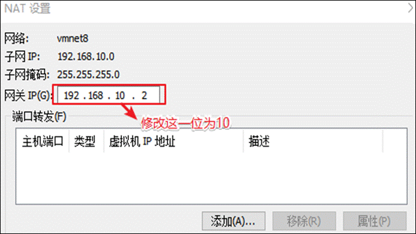

# 集群搭建

# 第一章　VMware安装

## 1.1 VMware安装

一台电脑本身是可以装多个操作系统的，但是做不到多个操作系统切换自如，所以我们需要一款软件帮助我们达到这个目的，不然数仓项目搭建不起来。

推荐的软件为VMware，VMware可以使用户在一台计算机上同时运行多个操作系统，还可以像Windows应用程序一样来回切换。用户可以如同操作真实安装的系统一样操作虚拟机系统，甚至可以在一台计算机上将几个虚拟机系统连接为一个局域网或者连接到互联网。

以下是VMware Workstation Pro 15.5的安装步骤

### 1.1.1 开始安装


### 1.2.2 欢迎界面


### 1.2.3 同意许可证


### 1.2.4 选择安装路径


### 1.2.5 用户体检计划

每次开启虚拟机时，会提醒让你更新版本，建议两个都不勾


### 1.2.6 快捷方式

建议勾选，安装后使用起来会比较方便


### 1.2.7 开始安装


### 1.2.8 等待安装完成


### 1.2.9 安装完成

输入许可证，激活VMware

注：如果点击的是完成也没关系，后面还是输入许可证的。


### 1.2.10 输入许可证

**1****）生成许可证（在当时安装包的同名的目录下）**


**2****）选择版本并生成许可证**


**3****）复制生成好的序列号**


**4****）将生成好的序列号粘贴到vmware****里**


### 1.2.11 VMware安装完毕


桌面上的快捷方式，双击它就可以使用啦。

# 第2章 CentOS

系统的安装得分两个步骤，第一步得配置一台电脑，选配CPU，内存，磁盘，网卡等硬件。第二步才是安装系统。

## 2.1 配置电脑

### 2.1.1 进入VMware

双击VMware图标，看到如下界面


### 2.1.2 自定义新的虚拟机


### 2.1.3 解决虚拟机的兼容性


### 2.1.4 选择当前虚拟机的操作系统

我们先配置电脑，再安装系统。


### 2.1.5 选择虚拟机将来需要安装的系统

因为不同的操作系统需要解决不同的兼容性问题，所以需要选择将来用什么系统，提前做适配。


### 2.1.6 配置电脑

给自己配置电脑取个名字，并存放在物理机的位置在哪。


### 2.1.7 选择CPU的个数

有个原则就是选满（跟物理机的CPU个数相同，但是不能超过）

**1****）** **查看物理机CPU****个数（Windows10****为例）**


**2****）** **设置虚拟机处理器的数量**


### 2.1.8 设置虚拟机的内存

内存大小有一定要求，建议4G，不能给太多，后期会有多台虚拟机同时启动


### 2.1.9 选择虚拟机上网方式

**1****）** **选择NAT****的方式**


2） 没有VMware之前物理机的网络适配器信息（每个人不同，我只有3个）


3）安装VMware之后物理机的网络适配器信息（会多两个vmnet1和vmnet8）


注：vmnet8是虚拟机使用NAT模式上网的网卡

### 2.1.10 选择对应的文件系统的IO方式


### 2.1.11 选择磁盘的类型


### 2.1.12 选择磁盘的种类


### 2.1.13 选择虚拟机的磁盘大小


### 1.1.14 虚拟机文件的存放位置


### 2.1.14 电脑配置完毕


## 2.2 安装系统（CentOS7）


注意：在安装系统之前需要检查自己虚拟机的bios的虚拟化是否打开（大部分的电脑都是打开的，大家可以先尝试直接安装，如果出现错误再去调试，没有出错就不用管了）

以下是查看虚拟机bios是否开启的方式

 （1）window10


（2）window7里面看不到（得去bios里面看）

（3）如果发现bios虚拟化没有开启怎么办，重启电脑，在加载界面时按f1-f10,或者电脑旁边一个小洞，具体怎么进入得去查一下（按照自己电脑的型号去查）

（4）修改虚拟化为开启（thinkpad为例）找到security 里面的VT并改成enabled


注：如果虚拟化没有开启报的是以下错误


### 2.2.1 选择cd/dvd的方式安装系统


### 2.2.2 系统安装引导界面

你得需要将鼠标点击进入界面中，但是鼠标会消失，你此刻得用键盘的上下键来控制选项，图标变白了表示当前选中的是哪个选项，然后敲回车，表示执行所选选项。

注意：如果这个时候你需要鼠标可以使用ctrl+alt一起按呼出鼠标


（1）耐心等待它的安装


（2）会自动跳转下面的界面


### 2.2.3 需要定制化的内容

按照编号依次点击


**1****）调整时间差**


**2****）安装GHOME****（图形化界面的方式）注意图上标注的点击顺序**


**3****）配置磁盘分区**


（1）手动添加分区


（2） 添加boot区 给上1G容量后点击添加挂载点


（3）添加swap交换分区


（4）配置根(/)目录


根目录作为存储使用，将剩下的空间都给他（50 - 4 - 1）= 45


3个分区都配置完毕过后可以点击完成


（5）分区配置完毕，点击接受更改


**4****）关闭kdump****本身虚拟机内存就不够，他会吃掉一部分内存，我们尽量省一点**


**5****）修改主机名**


**6****）是否打开安全协议（开启与否都可以）**


**7****）开始安装**


**8****）安装时间比较长，大概需要10****几分钟（设置root****用户密码，一定要设置）**


密码设置成什么自己决定，但是不要忘 建议使用（000000）


### 2.2.4 虚拟机的使用引导界面

**1****）** **安装完成** **重启虚拟机**


**2****）进入引导界面（以下内容就按照图片走，就不做过多解释）**


安装完成

### 2.2.5 切换root用户

当前登录的用户是刚刚创建的用户，权限会缺少，所以使用root，修改一些内容更加方便


1）切换root用户


刚才的引导再来一遍（就不再放图片了）


最后的用户变成root表示切换成功

## 2.3 网络配置

对安装好的VMware进行网络配置，方便虚拟机连接网络，本次设置建议选择NAT模式，需要宿主机的Windows和虚拟机的Linux能够进行网络连接，同时虚拟机的Linux可以通过宿主机的Windows进入互联网。

### 2.3.1 编辑VMware的网络配置




然后全部点击确定，VMware的网络配置就好了。

### 2.3.2 Windows的网络配置

以下以Window10为例

1）找到


按如上格式修改IP信息（地址，网关，DNS服务器），修改完毕后全部点击确定退出。

## 2.4 虚拟机网络IP修改地址配置

1）修改网络IP地址为静态IP地址，避免IP地址经常变化，从而方便节点服务器间的互相通信。

[root@hadoop100 ~]#vim /etc/sysconfig/network-scripts/ifcfg-ens33 

2）以下加粗的项必须修改，有值的按照下面的值修改，没有该项的则需要增加。

TYPE="Ethernet"  #网络类型（通常是Ethemet）

PROXY_METHOD="none"

BROWSER_ONLY="no"

**BOOTPROTO="static"  #IP****的配置方法[none|static|bootp|dhcp]****（引导时不使用协议|****静态分配IP|BOOTP****协议|DHCP****协议）**

DEFROUTE="yes"

IPV4_FAILURE_FATAL="no"

IPV6INIT="yes"

IPV6_AUTOCONF="yes"

IPV6_DEFROUTE="yes"

IPV6_FAILURE_FATAL="no"

IPV6_ADDR_GEN_MODE="stable-privacy"

NAME="ens33"  

UUID="e83804c1-3257-4584-81bb-660665ac22f6"  #随机id

DEVICE="ens33"  #接口名（设备,网卡）

ONBOOT="yes"  #系统启动的时候网络接口是否有效（yes/no）

\#IP地址

**IPADDR=192.168.10.100** 

\#网关 

**GATEWAY=192.168.10.2**   

\#域名解析器

**DNS1=192.168.10.2**

3）修改IP地址后的结果如图所示，执行“:wq”命令，保存退出


4）执行systemctl restart network命令，重启网络服务。如果报错，则执行“reboot”命令，重启虚拟机

[root@hadoop100 ~]# systemctl restart network

5）使用ifconfig命令查看当前IP

[root@hadoop100 ~]# ifconfig


6）保证Linux系统ifcfg-ens33文件中IP地址、虚拟网络编辑器地址和Windows系统VM8网络IP地址相同

## 2.5 修改主机名和hosts文件

**1****）修改主机名称**

[root@hadoop100 ~]# vim /etc/hostname

hadoop100

**2****）配置Linux****克隆机主机名称映射hosts****文件，打开/etc/hosts**

[root@hadoop100 ~]# vim /etc/hosts

添加如下内容

192.168.10.100 hadoop100

192.168.10.101 hadoop101

192.168.10.102 hadoop102

192.168.10.103 hadoop103

192.168.10.104 hadoop104

192.168.10.105 hadoop105

192.168.10.106 hadoop106

192.168.10.107 hadoop107

192.168.10.108 hadoop108

**3****）重启克隆机hadoop102** 

[root@hadoop100 ~]# reboot

**4****）修改windows****的主机映射文件（hosts****文件）**

（1）如果操作系统是window7，可以直接修改

​    （a）进入C:\Windows\System32\drivers\etc路径

​    （b）打开hosts文件并添加如下内容，然后保存

192.168.10.100 hadoop100

192.168.10.101 hadoop101

192.168.10.102 hadoop102

192.168.10.103 hadoop103

192.168.10.104 hadoop104

192.168.10.105 hadoop105

192.168.10.106 hadoop106

192.168.10.107 hadoop107

192.168.10.108 hadoop108

（2）如果操作系统是window10，先拷贝出来，修改保存以后，再覆盖即可

（a）进入C:\Windows\System32\drivers\etc路径

（b）拷贝hosts文件到桌面

（c）打开桌面hosts文件并添加如下内容

192.168.10.100 hadoop100

192.168.10.101 hadoop101

192.168.10.102 hadoop102

192.168.10.103 hadoop103

192.168.10.104 hadoop104

192.168.10.105 hadoop105

192.168.10.106 hadoop106

192.168.10.107 hadoop107

192.168.10.108 hadoop108

（d）将桌面hosts文件覆盖C:\Windows\System32\drivers\etc路径hosts文件

# 第3章 远程终端工具安装

通常在工作过程中，公司中使用的真实服务器或者是云服务器，都不允许除运维人员之外的员工直接接触，因此就需要通过远程登录的方式来操作。所以，远程登录工具就是必不可缺的，目前，比较主流的有Xshell，SecureCRT等，同学们可以根据自己的习惯自行选择，以下以Xshell5为例。

## 3.1 Xshell5安装和配置

### 3.1.1 安装Xshell5


1）一直点击下一步，但是有一页收费页，点击免费版，图如下


2）出现如下界面安装成功


### 3.1.2 配置Xshell终端

1）打开安装好的Xshell


2）编辑新链接


3）测试链接


4）连接成功


## 3.2 Xftp传输工具

### 3.2.1 安装Xftp


1）一直点击下一步，但是有一页收费页，点击免费版，图如下


2）出现如下界面表示安装成功


### 3.2.2 配置Xftp

1）打开安装好的Xftp


2）创建新链接


3）编辑新链接


4）测试新链接


出现以上界面表示链接成功，可以进行windows和linux系统互传数据

注：有可能会有部分人右边是乱码，可以使用以下方式修改，修改后重启Xftp


# 第４章 Hadoop运行环境搭建

## ４.1 模板虚拟机环境准备

安装模板虚拟机，IP地址**192.168.10.100**、主机名称**hadoop100**、内存**4G**、硬盘50G                         

**1**　　hadoop100虚拟机配置要求如下（本文Linux系统全部以CentOS-7.5-x86-1804为例）

（1）使用yum安装需要虚拟机可以正常上网，yum安装前可以先测试下虚拟机联网情况

```bash
[root@hadoop100 ~]# ping www.baidu.com
PING www.baidu.com (14.215.177.39) 56(84) bytes of data.
64 bytes from 14.215.177.39 (14.215.177.39): icmp_seq=1 ttl=128 time=8.60 ms
64 bytes from 14.215.177.39 (14.215.177.39): icmp_seq=2 ttl=128 time=7.72 ms
```

（2）安装epel-release

注：Extra Packages for Enterprise Linux是为“红帽系”的操作系统提供额外的软件包，适用于RHEL、CentOS和Scientific Linux。相当于是一个软件仓库，大多数rpm包在官方 repository 中是找不到的）

```bash
[root@hadoop100 ~]# yum install -y epel-release
```

（3）注意：如果Linux安装的是最小系统版，还需要安装如下工具；如果安装的是Linux桌面标准版，不需要执行如下操作

net-tool：工具包集合，包含ifconfig等命令

```bash
[root@hadoop100 ~]# yum install -y net-tools
```

vim：编辑器

```bash
[root@hadoop100 ~]# yum install -y vim
```

**2****）关闭防火墙，关闭防火墙开机自启**

```bash
[root@hadoop100 ~]# systemctl stop firewalld
[root@hadoop100 ~]# systemctl disable firewalld.service
```

​    注意：在企业开发时，通常单个服务器的防火墙时关闭的。公司整体对外会设置非常安全的防火墙

**3****）创建atguigu用户，并修改atguigu用户的密码

```bash
[root@hadoop100 ~]# useradd atguigu
[root@hadoop100 ~]# passwd atguigu
```

**4****）配置atguigu用户具有root权限，方便后期加sudo执行root权限的命令

```bash
[root@hadoop100 ~]# vim /etc/sudoers
```

修改/etc/sudoers文件，在%wheel这行下面添加一行，如下所示：

```bash
## Allow root to run any commands anywhere
root  ALL=(ALL)   ALL

## Allows people in group wheel to run all commands
%wheel ALL=(ALL)    ALL
atguigu  ALL=(ALL)   NOPASSWD:ALL
```

注意：atguigu这一行不要直接放到root行下面，因为所有用户都属于wheel组，你先配置了atguigu具有免密功能，但是程序执行到%wheel行时，该功能又被覆盖回需要密码。所以atguigu要放到%wheel这行下面。

**5****）在/opt目录下创建文件夹，并修改所属主和所属组

（1）在/opt目录下创建module、software文件夹

```bash
[root@hadoop100 ~]# mkdir /opt/module
[root@hadoop100 ~]# mkdir /opt/software
```

​    （2）修改module、software文件夹的所有者和所属组均为atguigu用户 

```bash
[root@hadoop100 ~]# chown atguigu:atguigu /opt/module 
[root@hadoop100 ~]# chown atguigu:atguigu /opt/software
```

（3）查看module、software文件夹的所有者和所属组

```bash
[root@hadoop100 ~]# cd /opt/
[root@hadoop100 opt]# ll
总用量 12
drwxr-xr-x. 2 atguigu atguigu 4096 5月 28 17:18 module
drwxr-xr-x. 2 root  root  4096 9月  7 2017 rh
drwxr-xr-x. 2 atguigu atguigu 4096 5月 28 17:18 software
```

**6****）卸载虚拟机自带的JDK

​    注意：如果你的虚拟机是最小化安装不需要执行这一步。

```bash
[root@hadoop100 ~]# rpm -qa | grep -i java | xargs -n1 rpm -e --nodeps 
```

 rpm -qa：查询所安装的所有rpm软件包

 grep -i：忽略大小写

 xargs -n1：表示每次只传递一个参数

rpm -e –nodeps：强制卸载软件

**7****）重启虚拟机

```bash
[root@hadoop100 ~]# reboot
```

## ４.2 克隆虚拟机

**1****）利用模板机hadoop100，克隆三台虚拟机：hadoop102、hadoop103、hadoop104

​    注意：克隆时，要先关闭hadoop100

**2****）修改克隆机IP，以下以hadoop102举例说明

（1）修改克隆虚拟机的静态IP

```bash
[atguigu@hadoop100 ~]# sudo vim /etc/sysconfig/network-scripts/ifcfg-ens33
```

改成

```bash
DEVICE=ens33
TYPE=Ethernet
ONBOOT=yes
BOOTPROTO=static
NAME="ens33"
IPADDR=192.168.10.102
PREFIX=24
GATEWAY=192.168.10.2
DNS1=192.168.10.2
```

（2）查看Linux虚拟机的虚拟网络编辑器，编辑->虚拟网络编辑器->VMnet8

​     

​     

（3）查看Windows系统适配器VMware Network Adapter VMnet8的IP地址

​     

（4）保证Linux系统ifcfg-ens33文件中IP地址、虚拟网络编辑器地址和Windows系统VM8网络IP地址相同。

**3****）修改克隆机主机名，以下以hadoop102举例说明**

​    （1）修改主机名称

```bash
[atguigu@hadoop100 ~]# sudo vim /etc/hostname

hadoop102
```

（2）配置Linux克隆机主机名称映射hosts文件，打开/etc/hosts

```bash
[atguigu@hadoop100 ~]# sudo vim /etc/hosts
```

添加如下内容

```bash
192.168.10.100 hadoop100
192.168.10.101 hadoop101
192.168.10.102 hadoop102
192.168.10.103 hadoop103
192.168.10.104 hadoop104
192.168.10.105 hadoop105
192.168.10.106 hadoop106
192.168.10.107 hadoop107
192.168.10.108 hadoop108
```

**4****）重启克隆机hadoop102

```bash
[atguigu@hadoop100 ~]# sudo reboot
```

**5****）修改windows的主机映射文件（hosts文件）

（1）如果操作系统是window7，可以直接修改 

​    ①进入**C:\Windows\System32\drivers\etc**路径

​    ②打开hosts文件并添加如下内容，然后保存

```bash
192.168.10.100 hadoop100
192.168.10.101 hadoop101
192.168.10.102 hadoop102
192.168.10.103 hadoop103
192.168.10.104 hadoop104
192.168.10.105 hadoop105
192.168.10.106 hadoop106
192.168.10.107 hadoop107
192.168.10.108 hadoop108
```

（2）如果操作系统是window10，先拷贝出来，修改保存以后，再覆盖即可

①进入**C:\Windows\System32\drivers\etc**路径

②拷贝hosts文件到桌面

③打开桌面hosts文件并添加如下内容

```
192.168.10.100 hadoop100
192.168.10.101 hadoop101
192.168.10.102 hadoop102
192.168.10.103 hadoop103
192.168.10.104 hadoop104
192.168.10.105 hadoop105
192.168.10.106 hadoop106
192.168.10.107 hadoop107
192.168.10.108 hadoop108
```

④将桌面hosts文件覆盖C:\Windows\System32\drivers\etc路径hosts文件

## ４.３ 编写集群分发脚本xsync

**1****）xsync集群分发脚本

（1）需求：循环复制文件到所有节点的相同目录下

（2）需求分析

①rsync命令原始拷贝：

```bash
rsync -av   /opt/module    root@hadoop103:/opt/
```

②期望脚本：

xsync　要同步的文件名称

③说明：在/home/atguigu/bin这个目录下存放的脚本，atguigu用户可以在系统任何地方直接执行。

（3）脚本实现

①在家目录/home/atguigu下创建bin文件夹

```bash
[atguigu@hadoop102 ~]$ mkdir bin
```

②在/home/atguigu/bin目录下创建xsync文件，以便全局调用

```bash
[atguigu@hadoop102 ~]$ cd /home/atguigu/bin
[atguigu@hadoop102 ~]$ vim xsync
```

在该文件中编写如下代码

```bash
#!/bin/bash
#1. 判断参数个数
if [ $# -lt 1 ]
then
 echo Not Enough Arguement!
 exit;
fi
#2. 遍历集群所有机器
for host in hadoop102 hadoop103 hadoop104
do
 echo ==================== $host ====================
 #3. 遍历所有目录，挨个发送
 for file in $@
 do
  #4 判断文件是否存在
  if [ -e $file ]
  then
   #5. 获取父目录
   pdir=$(cd -P $(dirname $file); pwd)
   #6. 获取当前文件的名称
   fname=$(basename $file)
   ssh $host "mkdir -p $pdir"
   rsync -av $pdir/$fname $host:$pdir
  else
   echo $file does not exists!
  fi
 done
done
```

③修改脚本xsync具有执行权限

```bash
[atguigu@hadoop102 bin]$ chmod +x xsync
```

④测试脚本

```bash
[atguigu@hadoop102 bin]$ xsync xsync
```

## 4.4 SSH无密登录配置

说明：这里面只配置了hadoop102、hadoop103到其他主机的无密登录；因为hadoop102未外配置的是NameNode，hadoop103配置的是ResourceManager，都要求对其他节点无密访问。

（1）hadoop102上生成公钥和私钥：

```bash
[atguigu@hadoop102 .ssh]$ ssh-keygen -t rsa
```

然后敲（三个回车），就会生成两个文件id_rsa（私钥）、id_rsa.pub（公钥）

（2）将hadoop102公钥拷贝到要免密登录的目标机器上

```bash
[atguigu@hadoop102 .ssh]$ ssh-copy-id hadoop102

[atguigu@hadoop102 .ssh]$ ssh-copy-id hadoop103

[atguigu@hadoop102 .ssh]$ ssh-copy-id hadoop104
```

（3）hadoop103上生成公钥和私钥：

```bash
[atguigu@hadoop103 .ssh]$ ssh-keygen -t rsa
```

然后敲（三个回车），就会生成两个文件id_rsa（私钥）、id_rsa.pub（公钥）

（4）将hadoop103公钥拷贝到要免密登录的目标机器上

```bash
[atguigu@hadoop103 .ssh]$ ssh-copy-id hadoop102

[atguigu@hadoop103 .ssh]$ ssh-copy-id hadoop103

[atguigu@hadoop103 .ssh]$ ssh-copy-id hadoop104
```

## 4.5 JDK准备

**1****）卸载现有JDK（3台节点）

```bash
[atguigu@hadoop102 opt]# sudo rpm -qa | grep -i java | xargs -n1 sudo rpm -e --nodeps

[atguigu@hadoop103 opt]# sudo rpm -qa | grep -i java | xargs -n1 sudo rpm -e --nodeps

[atguigu@hadoop104 opt]# sudo rpm -qa | grep -i java | xargs -n1 sudo rpm -e --nodeps
```

（1）rpm -qa：表示查询所有已经安装的软件包

（2）grep -i：表示过滤时不区分大小写

（3）xargs -n1：表示一次获取上次执行结果的一个值

（4）rpm -e --nodeps：表示卸载软件

**2****）用XShell工具将JDK导入到hadoop102的/opt/software文件夹下面

​                                   

**3****）在Linux系统下的opt目录中查看软件包是否导入成功

```bash
[atguigu@hadoop102 software]# ls /opt/software/
```

看到如下结果：

```bash
jdk-8u212-linux-x64.tar.gz
```

**4****）解压JDK到/opt/module目录下

```bash
[atguigu@hadoop102 software]# tar -zxvf jdk-8u212-linux-x64.tar.gz -C /opt/module/
[atguigu@hadoop102 module]$ mv jdk1.8.0_212/ jdk
```

**5****）配置JDK环境变量

（1）新建/etc/profile.d/my_env.sh文件

```bash
[atguigu@hadoop102 module]# sudo vim /etc/profile.d/my_env.sh
```

添加如下内容，然后保存（:wq）退出

```bash
#JAVA_HOME
export JAVA_HOME=/opt/module/jdk
export PATH=$PATH:$JAVA_HOME/bin
```

​    （2）让环境变量生效

```bash
[atguigu@hadoop102 software]$ source /etc/profile.d/my_env.sh
```

**6****）测试JDK是否安装成功

```bash
[atguigu@hadoop102 module]# java -version
```

如果能看到以下结果、则Java正常安装

```bash
java version "1.8.0_212"
```

**7****）分发JDK

```bash
[atguigu@hadoop102 module]$ xsync /opt/module/jdk
```

**8****）分发环境变量配置文件

```bash
[atguigu@hadoop102 module]$ sudo /home/atguigu/bin/xsync /etc/profile.d/my_env.sh
```

**9****）分别在hadoop103、hadoop104上执行source

```bash
[atguigu@hadoop103 module]$ source /etc/profile.d/my_env.sh
[atguigu@hadoop104 module]$ source /etc/profile.d/my_env.sh
```

## 4.６ 集群所有进程查看脚本

1）在/home/atguigu/bin目录下创建脚本xcall

```bash
[atguigu@hadoop102 bin]$ vim xcall
```

2）在脚本中编写如下内容

```bash
#! /bin/bash
for i in hadoop102 hadoop103 hadoop104
do
  echo --------- $i ----------
  ssh $i "$*"
done
```

3）修改脚本执行权限

```bash
[atguigu@hadoop102 bin]$ chmod 777 xcall
```

4）启动脚本

```bash
[atguigu@hadoop102 bin]$ xcall.sh jps
```

## ４.７Hadoop部署

**1****）集群部署规划

​     注意：NameNode和SecondaryNameNode不要安装在同一台服务器

​     注意：ResourceManager也很消耗内存，不要和NameNode、SecondaryNameNode配置在同一台机器上。

|      | hadoop102          | hadoop103                    | hadoop104                   |
| ---- | ------------------ | ---------------------------- | --------------------------- |
| HDFS | NameNode  DataNode | DataNode                     | SecondaryNameNode  DataNode |
| YARN | NodeManager        | ResourceManager  NodeManager | NodeManager                 |

 

**2****）将hadoop-3.1.3.tar.gz导入到opt目录下面的software文件夹下面

**3****）进入到Hadoop安装包路径下

```bash
[atguigu@hadoop102 ~]$ cd /opt/software/
```

**4****）解压安装文件到/opt/module下面

```bash
[atguigu@hadoop102 software]$ tar -zxvf hadoop-3.1.3.tar.gz -C /opt/module/
```

**5****）查看是否解压成功

```bash
[atguigu@hadoop102 software]$ ls /opt/module/hadoop-3.1.3
```

**6****）重命名

```bash
[atguigu@hadoop102 software]$ mv /opt/module/hadoop-3.1.3 /opt/module/hadoop
```

**7****）将Hadoop添加到环境变量

（1）获取Hadoop安装路径

```bash
[atguigu@hadoop102 hadoop]$ pwd
/opt/module/hadoop
```

（2）打开/etc/profile.d/my_env.sh文件

```bash
[atguigu@hadoop102 hadoop]$ sudo vim /etc/profile.d/my_env.sh
```

在profile文件末尾添加JDK路径：（shitf+g）

```bash
#HADOOP_HOME
export HADOOP_HOME=/opt/module/hadoop
export PATH=$PATH:$HADOOP_HOME/bin
export PATH=$PATH:$HADOOP_HOME/sbin
```

（3）保存后退出

（4）分发环境变量文件

```bash
[atguigu@hadoop102 hadoop]$ sudo /home/atguigu/bin/xsync /etc/profile.d/my_env.sh
```

（5）source 生效（3台节点）

```bash
[atguigu@hadoop102 module]$ source /etc/profile.d/my_env.sh
[atguigu@hadoop103 module]$ source /etc/profile.d/my_env.sh
[atguigu@hadoop104 module]$ source /etc/profile.d/my_env.sh
```

## ４.８ 配置集群

1）核心配置文件

配置core-site.xml

```bash
[atguigu@hadoop102 ~]$ cd $HADOOP_HOME/etc/hadoop
[atguigu@hadoop102 hadoop]$ vim core-site.xml
```

文件内容如下：

```xml
<?xml version="1.0" encoding="UTF-8"?>
<?xml-stylesheet type="text/xsl" href="configuration.xsl"?>
<configuration>
  <!-- 指定NameNode的地址 -->
  <property>
    <name>fs.defaultFS</name>
    <value>hdfs://hadoop102:8020</value>
</property>
<!-- 指定hadoop数据的存储目录 -->
  <property>
   　<name>hadoop.tmp.dir</name>
    <value>/opt/module/hadoop/data</value>
</property>
<!-- 配置HDFS网页登录使用的静态用户为atguigu -->
  <property>
    <name>hadoop.http.staticuser.user</name>
    <value>atguigu</value>
　</property>
<!-- 配置该atguigu(superUser)允许通过代理访问的主机节点 -->
  <property>
      <name>hadoop.proxyuser.atguigu.hosts</name>
    　<value>*</value>
</property>
<!-- 配置该atguigu(superUser)允许通过代理用户所属组 -->
  <property>
    <name>hadoop.proxyuser.atguigu.groups</name>
    <value>*</value>
</property>
<!-- 配置该atguigu(superUser)允许通过代理的用户-->
  <property>
    <name>hadoop.proxyuser.atguigu.users</name>
    <value>*</value>
</property>
</configuration>
```

2）HDFS配置文件

配置hdfs-site.xml

```bash
[atguigu@hadoop102 hadoop]$ vim hdfs-site.xml
```

文件内容如下：

```xml
<?xml version="1.0" encoding="UTF-8"?>
<?xml-stylesheet type="text/xsl" href="configuration.xsl"? 
<configuration>
  <!-- nn web端访问地址-->
  <property>
    <name>dfs.namenode.http-address</name>
    <value>hadoop102:9870</value>
  </property>
  <!-- 2nn web端访问地址-->
  <property>
    <name>dfs.namenode.secondary.http-address</name>
    <value>hadoop104:9868</value>
  </property>
  <!-- 测试环境指定HDFS副本的数量1 -->
  <property>
    <name>dfs.replication</name>
    <value>3</value>
  </property>
</configuration>
```

3）YARN配置文件

配置yarn-site.xml

```bash
[atguigu@hadoop102 hadoop]$ vim yarn-site.xml
```

文件内容如下：

```xml
<?xml version="1.0" encoding="UTF-8"?>
<?xml-stylesheet type="text/xsl" href="configuration.xsl"?>
<configuration>
  <!-- 指定MR走shuffle -->
  <property>
    <name>yarn.nodemanager.aux-services</name>
    <value>mapreduce_shuffle</value>
  </property>
  <!-- 指定ResourceManager的地址-->
  <property>
    <name>yarn.resourcemanager.hostname</name>
    <value>hadoop103</value>
  </property>
  <!-- 环境变量的继承 -->
  <property>
    <name>yarn.nodemanager.env-whitelist</name>    　　　　　
  <value>JAVA_HOME,HADOOP_COMMON_HOME,HADOOP_HDFS_HOME,HADOOP_CONF_DIR,CLASSPATH_PREPEND_DISTCACHE,HADOOP_YARN_HOME,HADOOP_MAPRED_HOME</value>
  </property>
  <!--yarn单个容器允许分配的最大最小内存 -->
  <property>
    <name>yarn.scheduler.minimum-allocation-mb</name>
    <value>512</value>
  </property>
  <property>
    <name>yarn.scheduler.maximum-allocation-mb</name>
    <value>4096</value>
  </property>
  <!-- yarn容器允许管理的物理内存大小 -->
  <property>
    <name>yarn.nodemanager.resource.memory-mb</name>
    <value>4096</value>
  </property>
  <!-- 关闭yarn对物理内存和虚拟内存的限制检查 -->
  <property>
    <name>yarn.nodemanager.pmem-check-enabled</name>
    <value>true</value>
  </property>
  <property>
    <name>yarn.nodemanager.vmem-check-enabled</name>
    <value>false</value>
  </property>
</configuration>
```

4）MapReduce配置文件

配置mapred-site.xml

```bash
[atguigu@hadoop102 hadoop]$ vim mapred-site.xml
```

文件内容如下：

```xml
<?xml version="1.0" encoding="UTF-8"?>
<?xml-stylesheet type="text/xsl" href="configuration.xsl"?>
<configuration>
  <!-- 指定MapReduce程序运行在Yarn上 -->
  <property>
    <name>mapreduce.framework.name</name>
    <value>yarn</value>
  </property>
</configuration>
```

5）配置workers

```bash
[atguigu@hadoop102 hadoop]$ vim /opt/module/hadoop/etc/hadoop/workers
```

在该文件中增加如下内容：

```ｂ
hadoop102
hadoop103
hadoop104
```

注意：该文件中添加的内容结尾不允许有空格，文件中不允许有空行。

## ４.９配置历史服务器

为了查看程序的历史运行情况，需要配置一下历史服务器。具体配置步骤如下：

**1****）配置mapred-site.xml

```bash
[atguigu@hadoop102 hadoop]$vim mapred-site.xml
```

在该文件里面增加如下配置。

```xml
<!-- 历史服务器端地址 -->
<property>
  <name>mapreduce.jobhistory.address</name>
  <value>hadoop102:10020</value>
</property>
<!-- 历史服务器web端地址 -->
<property>
  <name>mapreduce.jobhistory.webapp.address</name>
  <value>hadoop102:19888</value>
</property>
```

## ４.１０ 配置日志的聚集

日志聚集概念：应用运行完成以后，将程序运行日志信息上传到HDFS系统上。

日志聚集功能好处：可以方便的查看到程序运行详情，方便开发调试。

注意：开启日志聚集功能，需要重新启动NodeManager 、ResourceManager和HistoryManager。

开启日志聚集功能具体步骤如下：

**1****）配置yarn-site.xml

```bash
[atguigu@hadoop102 hadoop]$ vim yarn-site.xml
```

在该文件里面增加如下配置。

```xml
<!-- 开启日志聚集功能 -->
<property>
  <name>yarn.log-aggregation-enable</name>
  <value>true</value>
</property>
<!-- 设置日志聚集服务器地址 -->
<property> 
  <name>yarn.log.server.url</name> 
  <value>http://hadoop102:19888/jobhistory/logs</value>
</property>
<!-- 设置日志保留时间为7天 -->
<property>
  <name>yarn.log-aggregation.retain-seconds</name>
  <value>604800</value>
</property>
```

分发Hadoop

```bash
[atguigu@hadoop102 hadoop]$ xsync /opt/module/hadoop/
```

## ４.１１群起集群

**1****）启动集群

​    （1）**如果集群是第一次启动**，需要在hadoop102节点格式化NameNode（注意格式化之前，一定要先停止上次启动的所有namenode和datanode进程，然后再删除data和log数据）

```bash
[atguigu@hadoop102 hadoop]$ bin/hdfs namenode -format
```

（2）启动HDFS

```bash
[atguigu@hadoop102 hadoop]$ sbin/start-dfs.sh
```

（3）在配置了ResourceManager的节点（hadoop103）启动YARN

```bash
[atguigu@hadoop103 hadoop]$ sbin/start-yarn.sh
```

（4）Web端查看HDFS的Web页面：http://hadoop102:9870/

（5）Web端查看SecondaryNameNode

　（a）浏览器中输入：http://hadoop104:9868/status.html

  　（b）查看SecondaryNameNode信息 

7 Hadoop群起脚本

```bash
[atguigu@hadoop102 bin]$ pwd
/home/atguigu/bin
[atguigu@hadoop102 bin]$ vim hdp.sh
```

输入如下内容：

\

```shell
#!/bin/bash
if [ $# -lt 1 ]
then
  echo "No Args Input..."
  exit ;
fi
case $1 in
"start")
    echo " =================== 启动 hadoop集群 ==================="
    echo " --------------- 启动 hdfs ---------------"
    ssh hadoop102 "/opt/module/hadoop/sbin/start-dfs.sh"
    echo " --------------- 启动 yarn ---------------"
    ssh hadoop103 "/opt/module/hadoop/sbin/start-yarn.sh"
    echo " --------------- 启动 historyserver ---------------"
    ssh hadoop102 "/opt/module/hadoop/bin/mapred --daemon start historyserver"
;;
"stop")
    echo " =================== 关闭 hadoop集群 ===================" 
    echo " --------------- 关闭 historyserver ---------------"
    ssh hadoop102 "/opt/module/hadoop/bin/mapred --daemon stop historyserver"
    echo " --------------- 关闭 yarn ---------------"
    ssh hadoop103 "/opt/module/hadoop/sbin/stop-yarn.sh"
    echo " --------------- 关闭 hdfs ---------------"
    ssh hadoop102 "/opt/module/hadoop/sbin/stop-dfs.sh"
;;
*)
  echo "Input Args Error..."
;;
esac
```

```bash
[atguigu@hadoop102 bin]$ chmod 777 hdp.sh
```

# 第五章　zookeeper安装

## ５.1 分布式安装部署

**1****）集群规划

在hadoop102、hadoop103和hadoop104三个节点上部署Zookeeper。

|           | 服务器hadoop102 | 服务器hadoop103 | 服务器hadoop104 |
| --------- | --------------- | --------------- | --------------- |
| Zookeeper | Zookeeper       | Zookeeper       | Zookeeper       |

**2****）解压安装

（1）解压Zookeeper安装包到/opt/module/目录下

```bash
[atguigu@hadoop102 software]$ tar -zxvf apache-zookeeper-3.5.7-bin.tar.gz -C /opt/module/
```

（2）修改/opt/module/apache-zookeeper-3.5.7-bin名称为zookeeper-3.5.7

```bash
[atguigu@hadoop102 module]$ mv apache-zookeeper-3.5.7-bin/ zookeeper
```

**3****）配置服务器编号

（1）在/opt/module/zookeeper-3.5.7/这个目录下创建zkData

```bash
[atguigu@hadoop102 zookeeper]$ mkdir zkData
```

（2）在/opt/module/zookeeper-3.5.7/zkData目录下创建一个myid的文件

```bash
[atguigu@hadoop102 zkData]$ vim myid
```

添加myid文件，注意一定要在linux里面创建，在notepad++里面很可能乱码

在文件中添加与server对应的编号：

**2**

**4****）配置zoo.cfg文件

（1）重命名/opt/module/zookeeper-3.5.7/conf这个目录下的zoo_sample.cfg为zoo.cfg

```bash
[atguigu@hadoop102 conf]$ mv zoo_sample.cfg zoo.cfg
```

（2）打开zoo.cfg文件

```bash
[atguigu@hadoop102 conf]$ vim zoo.cfg
```

修改数据存储路径配置

```bash
dataDir=/opt/module/zookeeper/zkData
```

增加如下配置

```bash
#######################cluster##########################
server.2=hadoop102:2888:3888
server.3=hadoop103:2888:3888
server.4=hadoop104:2888:3888
```

（3）同步/opt/module/zookeeper-3.5.7目录内容到hadoop103、hadoop104

```bash
[atguigu@hadoop102 module]$ xsync zookeeper/
```

（4）分别修改hadoop103、hadoop104上的myid文件中内容为**3、4**

（5）**zoo.cfg**配置参数解读

server.A=B:C:D。

**A**是一个数字，表示这个是第几号服务器；

集群模式下配置一个文件myid，这个文件在dataDir目录下，这个文件里面有一个数据就是A的值，Zookeeper启动时读取此文件，拿到里面的数据与zoo.cfg里面的配置信息比较从而判断到底是哪个server。

**B**是这个服务器的地址；

**C**是这个服务器Follower与集群中的Leader服务器交换信息的端口；

**D**是万一集群中的Leader服务器挂了，需要一个端口来重新进行选举，选出一个新的Leader，而这个端口就是用来执行选举时服务器相互通信的端口。

**5****）集群操作**

（1）分别启动Zookeeper

```bash
[atguigu@hadoop102 zookeeper]$ bin/zkServer.sh start
[atguigu@hadoop103 zookeeper]$ bin/zkServer.sh start
[atguigu@hadoop104 zookeeper]$ bin/zkServer.sh start
```

（2）查看状态

```bash
[atguigu@hadoop102 zookeeper]# bin/zkServer.sh status
JMX enabled by default
Using config: /opt/module/zookeeper/bin/../conf/zoo.cfg
Mode: follower
[atguigu@hadoop103 zookeeper]# bin/zkServer.sh status
JMX enabled by default
Using config: /opt/module/zookeeper/bin/../conf/zoo.cfg
Mode: leader
[atguigu@hadoop104 zookeeper]# bin/zkServer.sh status
JMX enabled by default
Using config: /opt/module/zookeeper/bin/../conf/zoo.cfg
Mode: follower
```

## ５.2 ZK集群启动停止脚本

（1）在hadoop102的/home/atguigu/bin目录下创建脚本

```bash
[atguigu@hadoop102 bin]$ vim zk.sh
```

​    在脚本中编写如下内容

\

```shell
#!/bin/bash
case $1 in
"start"){
  for i in hadoop102 hadoop103 hadoop104
  do
    echo ---------- zookeeper $i 启动 ------------
   　ssh $i "/opt/module/zookeeper/bin/zkServer.sh start"
  done
};;
"stop"){
  for i in hadoop102 hadoop103 hadoop104
  do
    echo ---------- zookeeper $i 停止 ------------  
   ssh $i "/opt/module/zookeeper/bin/zkServer.sh stop"
  done
};;
"status"){
  for i in hadoop102 hadoop103 hadoop104
  do
    echo ---------- zookeeper $i 状态 ------------  
   ssh $i "/opt/module/zookeeper/bin/zkServer.sh status"
  done
};;
esac
```

（2）增加脚本执行权限

```bash
[atguigu@hadoop102 bin]$ chmod 777 zk.sh
```

（3）Zookeeper集群启动脚本

```bash
[atguigu@hadoop102 module]$ zk.sh start
```

（4）Zookeeper集群停止脚本

```bash
[atguigu@hadoop102 module]$ zk.sh stop
```

## ５.3 客户端命令行操作

| 命令基本语法 | 功能描述                                                     |
| ------------ | ------------------------------------------------------------ |
| help         | 显示所有操作命令                                             |
| ls path      | 使用 ls 命令来查看当前znode的子节点  -w 监听子节点变化  -s  附加次级信息 |
| create       | 普通创建  -s 含有序列  -e 临时（重启或者超时消失）           |
| get path     | 获得节点的值  -w 监听节点内容变化  -s  附加次级信息          |
| set          | 设置节点的具体值                                             |
| stat         | 查看节点状态                                                 |
| delete       | 删除节点                                                     |
| deleteall    | 递归删除节点                                                 |

**1****）启动客户端**

```bash
[atguigu@hadoop103 zookeeper]$ bin/zkCli.sh
```

# 第六章　Kafka集群安装

### ６.1 集群规划

| hadoop102 | hadoop103 | hadoop104 |
| --------- | --------- | --------- |
| zk        | zk        | zk        |
| kafka     | kafka     | kafka     |

### ６.2 集群部署

**0****）官方下载地址：http://kafka.apache.org/downloads.html

**1****）解压安装包

```bash
[atguigu@hadoop102 software]$ tar -zxvf kafka_2.12-3.0.0.tgz -C /opt/module/
```

**2****）修改解压后的文件名称

```bash
[atguigu@hadoop102 module]$ mv kafka_2.12-3.0.0/ kafka
```

**3****）进入到/opt/module/kafka目录，修改配置文件

```bash
[atguigu@hadoop102 kafka]$ cd config/
[atguigu@hadoop102 config]$ vim server.properties
```

输入以下内容：

```properties
#broker的全局唯一编号，不能重复，只能是数字。
broker.id=0
#处理网络请求的线程数量
num.network.threads=3
#用来处理磁盘IO的线程数量
num.io.threads=8
#发送套接字的缓冲区大小
socket.send.buffer.bytes=102400
#接收套接字的缓冲区大小
socket.receive.buffer.bytes=102400
#请求套接字的缓冲区大小
socket.request.max.bytes=104857600
#kafka运行日志(数据)存放的路径，路径不需要提前创建，kafka自动帮你创建，可以配置多个磁盘路径，路径与路径之间可以用"，"分隔
log.dirs=/opt/module/kafka/datas
#topic在当前broker上的分区个数
num.partitions=1
#用来恢复和清理data下数据的线程数量
num.recovery.threads.per.data.dir=1
# 每个topic创建时的副本数，默认时1个副本
offsets.topic.replication.factor=1
#segment文件保留的最长时间，超时将被删除
log.retention.hours=168
#每个segment文件的大小，默认最大1G
log.segment.bytes=1073741824
# 检查过期数据的时间，默认5分钟检查一次是否数据过期
log.retention.check.interval.ms=300000
#配置连接Zookeeper集群地址（在zk根目录下创建/kafka，方便管理）
zookeeper.connect=hadoop102:2181,hadoop103:2181,hadoop104:2181/kafka
```

**4****）分发安装包

```bash
[atguigu@hadoop102 module]$ xsync kafka/
```

**5****）分别在hadoop103和hadoop104上修改配置文件/opt/module/kafka/config/server.properties中的broker.id=1、broker.id=2

​    注：broker.id不得重复，整个集群中唯一。

```bash
[atguigu@hadoop103 module]$ vim kafka/config/server.properties
修改:
# The id of the broker. This must be set to a unique integer for each broker.
broker.id=1
[atguigu@hadoop104 module]$ vim kafka/config/server.properties
修改:
# The id of the broker. This must be set to a unique integer for each broker.
broker.id=2
```

**6****）配置环境变量

（1）在/etc/profile.d/my_env.sh文件中增加kafka环境变量配置

```bash
[atguigu@hadoop102 module]$ sudo vim /etc/profile.d/my_env.sh
```

增加如下内容：

```bash
#KAFKA_HOME
export KAFKA_HOME=/opt/module/kafka
export PATH=$PATH:$KAFKA_HOME/bin
```

（2）刷新一下环境变量。

```bash
[atguigu@hadoop102 module]$ source /etc/profile
```

（3）分发环境变量文件到其他节点，并source。

```bash
[atguigu@hadoop102 module]$ sudo /home/atguigu/bin/xsync /etc/profile.d/my_env.sh
[atguigu@hadoop103 module]$ source /etc/profile
[atguigu@hadoop104 module]$ source /etc/profile
```

**7****）启动集群

（1）先启动Zookeeper集群，然后启动Kafka。

```bash
[atguigu@hadoop102  kafka]$ zk.sh start 
```

（2）依次在hadoop102、hadoop103、hadoop104节点上启动Kafka。

```bash
[atguigu@hadoop102 kafka]$ bin/kafka-server-start.sh -daemon config/server.properties
[atguigu@hadoop103 kafka]$ bin/kafka-server-start.sh -daemon config/server.properties
[atguigu@hadoop104 kafka]$ bin/kafka-server-start.sh -daemon config/server.properties
```

注意：配置文件的路径要能够到server.properties。

**8****）**关闭集群

```bash
[atguigu@hadoop102 kafka]$ bin/kafka-server-stop.sh 
[atguigu@hadoop103 kafka]$ bin/kafka-server-stop.sh 
[atguigu@hadoop104 kafka]$ bin/kafka-server-stop.sh 
```

### 6.3 集群启停脚本

1）在/home/atguigu/bin目录下创建文件kf.sh脚本文件

```bash
[atguigu@hadoop102 bin]$ vim kf.sh
```

脚本如下：

```shell
#! /bin/bash
case $1 in
"start"){
  for i in hadoop102 hadoop103 hadoop104
  do
    echo " --------启动 $i Kafka-------"
    ssh $i "/opt/module/kafka/bin/kafka-server-start.sh -daemon /opt/module/kafka/config/server.properties"
  done
};;
"stop"){
  for i in hadoop102 hadoop103 hadoop104
  do
    echo " --------停止 $i Kafka-------"
    ssh $i "/opt/module/kafka/bin/kafka-server-stop.sh "
  done
};;
esac
```

2）添加执行权限

```bash
[atguigu@hadoop102 bin]$ chmod +x kf.sh
```

3）启动集群命令

```bash
[atguigu@hadoop102 ~]$ kf.sh start
```

4）停止集群命令

```bash
[atguigu@hadoop102 ~]$ kf.sh stop
```

**注意：**停止Kafka集群时，一定要等Kafka所有节点进程全部停止后再停止Zookeeper集群。因为Zookeeper集群当中记录着Kafka集群相关信息，Zookeeper集群一旦先停止，Kafka集群就没有办法再获取停止进程的信息，只能手动杀死Kafka进程了。

### 6.4 Kafka命令行操作

#### 6.2.1 主题命令行操作

1）查看操作主题命令参数

```bash
[atguigu@hadoop102 kafka]$ bin/kafka-topics.sh
```

| 参数                                              | 描述                                 |
| ------------------------------------------------- | ------------------------------------ |
| --bootstrap-server <String: server toconnect to>  | 连接的Kafka Broker主机名称和端口号。 |
| --topic <String: topic>                           | 操作的topic名称。                    |
| --create                                          | 创建主题。                           |
| --delete                                          | 删除主题。                           |
| --alter                                           | 修改主题。                           |
| --list                                            | 查看所有主题。                       |
| --describe                                        | 查看主题详细描述。                   |
| --partitions <Integer: # of partitions>           | 设置分区数。                         |
| --replication-factor<Integer: replication factor> | 设置分区副本。                       |
| --config <String: name=value>                     | 更新系统默认的配置。                 |

2）查看当前服务器中的所有topic

```bash
[atguigu@hadoop102 kafka]$ bin/kafka-topics.sh --bootstrap-server hadoop102:9092 --list
```

3）创建first topic

```bash
[atguigu@hadoop102 kafka]$ bin/kafka-topics.sh --bootstrap-server hadoop102:9092 --create --partitions 1 --replication-factor 3 --topic first
选项说明：
--topic 定义topic名
--replication-factor 定义副本数
--partitions 定义分区数
```

4）查看first主题的详情

```bash
[atguigu@hadoop102 kafka]$ bin/kafka-topics.sh --bootstrap-server hadoop102:9092 --describe --topic first
```

5）修改分区数（注意：分区数只能增加，不能减少）

```bash
[atguigu@hadoop102 kafka]$ bin/kafka-topics.sh --bootstrap-server hadoop102:9092 --alter --topic first --partitions 3
```

6）再次查看first主题的详情

```bash
[atguigu@hadoop102 kafka]$ bin/kafka-topics.sh --bootstrap-server hadoop102:9092 --describe --topic first
```

7）删除topic

```bash
[atguigu@hadoop102 kafka]$ bin/kafka-topics.sh --bootstrap-server hadoop102:9092 --delete --topic first
```

#### 6.2.2 生产者命令行操作

1）查看操作生产者命令参数

```bash
[atguigu@hadoop102 kafka]$ bin/kafka-console-producer.sh
```

| 参数                                             | 描述                                 |
| ------------------------------------------------ | ------------------------------------ |
| --bootstrap-server <String: server toconnect to> | 连接的Kafka Broker主机名称和端口号。 |
| --topic <String: topic>                          | 操作的topic名称。                    |

2）发送消息

```bash
[atguigu@hadoop102 kafka]$ bin/kafka-console-producer.sh --bootstrap-server hadoop102:9092 --topic first
>hello world
>atguigu atguigu
```

#### 6.2.3 消费者命令行操作

**1****）查看操作消费者命令参数

```bash
[atguigu@hadoop102 kafka]$ bin/kafka-console-consumer.sh
```

| 参数                                             | 描述                                 |
| ------------------------------------------------ | ------------------------------------ |
| --bootstrap-server <String: server toconnect to> | 连接的Kafka Broker主机名称和端口号。 |
| --topic <String: topic>                          | 操作的topic名称。                    |
| --from-beginning                                 | 从头开始消费。                       |
| --group <String: consumer group id>              | 指定消费者组名称。                   |

**2****）消费消息

（1）消费first主题中的数据。

```bash
[atguigu@hadoop102 kafka]$ bin/kafka-console-consumer.sh --bootstrap-server hadoop102:9092 --topic first
```

（2）把主题中所有的数据都读取出来（包括历史数据）。

```bash
[atguigu@hadoop102 kafka]$ bin/kafka-console-consumer.sh --bootstrap-server hadoop102:9092 --from-beginning --topic first
```

# 第七章Flume部署安装

### ７.1 Flume安装部署

#### ７.1.1 安装地址

（1） Flume官网地址：http://flume.apache.org/

（2）文档查看地址：http://flume.apache.org/FlumeUserGuide.html

（3）下载地址：http://archive.apache.org/dist/flume/

#### ７.1.2 安装部署

（1）将apache-flume-1.9.0-bin.tar.gz上传到linux的/opt/software目录下

（2）解压apache-flume-1.9.0-bin.tar.gz到/opt/module/目录下

```bash
[atguigu@hadoop102 software]$ tar -zxf /opt/software/apache-flume-1.9.0-bin.tar.gz -C /opt/module/
```

（3）修改apache-flume-1.9.0-bin的名称为flume

```bash
[atguigu@hadoop102 module]$ mv /opt/module/apache-flume-1.9.0-bin /opt/module/flume
```

（4）将lib文件夹下的guava-11.0.2.jar删除以兼容Hadoop 3.1.3ｂ

```bash
[atguigu@hadoop102 module]$ rm /opt/module/flume/lib/guava-11.0.2.jar
```

注意：删除guava-11.0.2.jar的服务器节点，一定要配置hadoop环境变量。否则会报如下异常。

```java
Caused by: java.lang.ClassNotFoundException: com.google.common.collect.Lists
    at java.net.URLClassLoader.findClass(URLClassLoader.java:382)
    at java.lang.ClassLoader.loadClass(ClassLoader.java:424)
    at sun.misc.Launcher$AppClassLoader.loadClass(Launcher.java:349)
    at java.lang.ClassLoader.loadClass(ClassLoader.java:357)
    ... 1 more
```

（5）修改conf目录下的log4j.properties配置文件，配置日志文件路径

```bash
[atguigu@hadoop102 conf]$ vim log4j.properties
```

```properties
flume.log.dir=/opt/module/flume/logs
```

### 7.2分发Flume

```bash
[atguigu@hadoop102 ~]$ xsync /opt/module/flume/
```

### 7.3 项目经验

（1）堆内存调整

Flume堆内存通常设置为4G或更高，配置方式如下：

修改/opt/module/flume/conf/flume-env.sh文件，配置如下参数**（虚拟机环境暂不配置）**

```sh
export JAVA_OPTS="-Xms4096m -Xmx4096m -Dcom.sun.management.jmxremote"
```

注：

-Xms表示JVM Heap(堆内存)最小尺寸，初始分配；

-Xmx 表示JVM Heap(堆内存)最大允许的尺寸，按需分配。