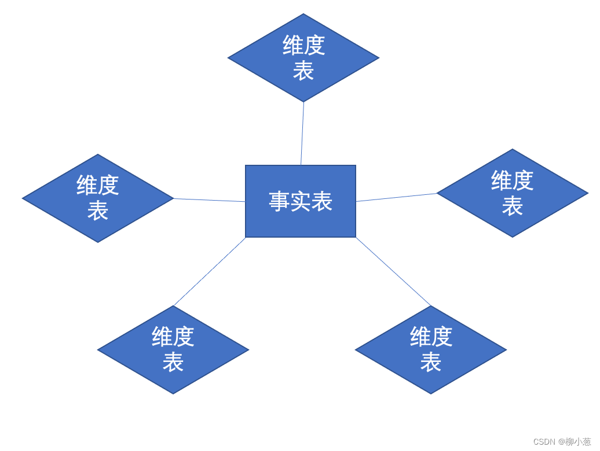
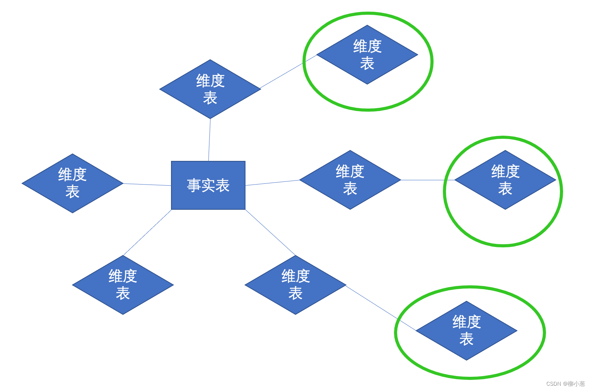
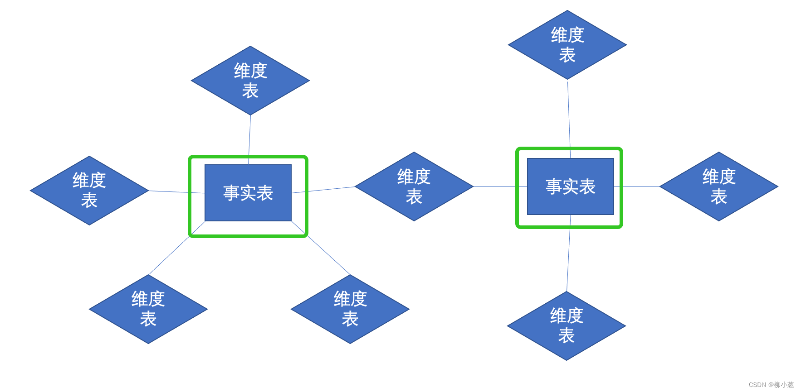
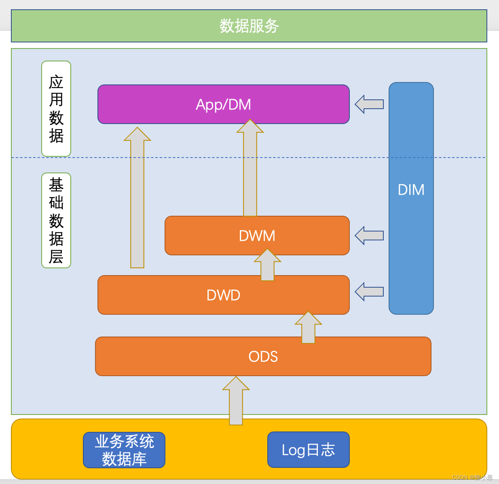
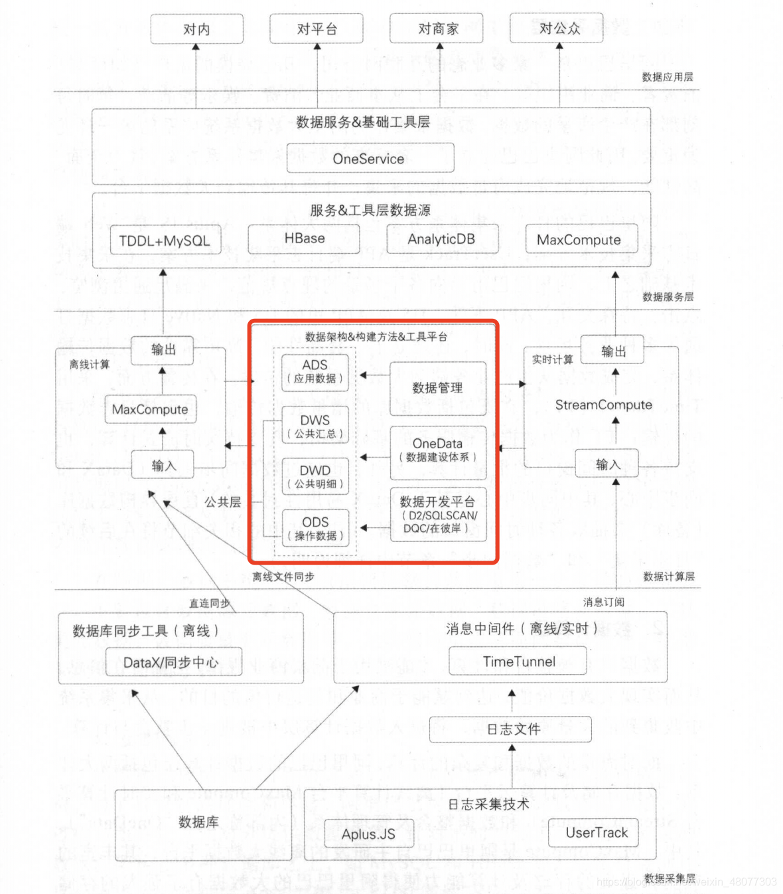

### 1数据仓库的产生

对于企业来说，数据大多都是存放在线上的业务系统中，比如：生产管理系统、销售系统、库存管理系统等，随着业务等进行，数据会源源不断的产生，一般都存储在业务数据库之中，如mysql、orcale中，用来支持业务系统的运行。
但是随着时间的流逝，业务系统中的数据会越来越多，存放在数据库中的数据需要进行分析的时候，会关联很多表、有些表访问次数多、有些表访问次数少，满足不了数据分析的需求。

#### 1.1数据库和数据仓库

数据库的设计一般采用的是ER实体模型，严格要求满足3NF来尽可能减少数据的冗余，而数据仓库是不需要严格满足3NF的。

1NF：数据库表的每一列都是不可分割的原子数据项。
2NF：确保数据库表中的每一列都和主键相关，而不能只与主键的某一部分相关（消除部分依赖）
3NF：确保数据表中的每一列数据都和主键直接相关，而不能间接相关（消除传递依赖）

我们需要介绍2个概念：OLTP和OLAP，这两个概念代表着对数据处理的两种方式，这两种处理方式，也就对应着数据库和数据仓库存储数据的意义。

**联机事务处理OLTP(On-line transaction processing)**： 对数据库联机的日常操作，通常是对一个或者一组记录的查询和者更新，主要是为企业的特定应用服务的，在事务处理环境中，人们关心的是响应时间、数据的安全性和完整性。

**联机分析处理OLAP(On-Line Analytical Processing)**: 用于管理人员的决策分析，决策型数据大多为历史性、汇总性或计算性数据、常常需要访问大量的历史数据，支持复杂查询和多维分析。分析型处理过程中经常用到外部数据，这一部分数据不是由事务型处理系统产生的，而是来源于其他外部数据源。
OLTP和OLAP的区别：

|    特性    |            OLTP             |              OLAP              |
| :--------: | :-------------------------: | :----------------------------: |
|    特征    |          操作处理           |            信息处理            |
|    用户    | 办事员、DBA、数据库专业人员 | 数据分析师、项目经理、产品经理 |
|    功能    |          日常操作           |     长期信息需求、决策支持     |
|   DB设计   |    基于ER模型、面向应用     |       维度建模、面向主题       |
|    数据    |      当前的；确保最新       |       历史的；跨时间维护       |
|    汇总    |      原始的，高度详细       |         汇总的、统一的         |
|    视图    |       详细，一般关系        |          汇总、多维的          |
|  工作单位  |       短的、简单事务        |            复杂查询            |
|    存取    |            读/写            |            主要是读            |
|    关注    |          数据进入           |            信息输出            |
|    操作    |     关键字上的索引/散列     |            大量扫描            |
| 访问记录数 |           数十个            |             数百万             |
|   用户数   |            数千             |              数百              |
|   DB规模   |          100M到GB           |           100GB到TB            |
|    优先    |      高性能、高可用性       |     高灵活性，端点用户自治     |
|   用户数   |            数千             |              数百              |
|    度量    |         事务吞吐量          |      查询吞吐量，响应时间      |

T for transaction，单次查询数据量小、并发高、随机性强、毫秒级延迟、ACID
              MySQL、PostgreSQL、SQL Server、Oracle
A for Analysis，大数据量、低并发、批量、秒级至分钟级延迟、不要求ACID，追求“最终一致性”
              Hive、HBase、Spark、Clickhouse

### 2 数据仓库建模思想

#### 2.1 ER模型

ER模型，也称为实体关系模型（ Entity Relationship, ER）用实体-关系-实体的模式来描述企业业务，在范式理论上符合 3NF。数据仓库中的 3NF 与 OLTP 系统中的 3NF 的区别在于，它是站在企业角度面向主题的抽象，而不是针对某个具体业务流程的实体对象关系的抽象。主要有**以下特点**：

需要全面了解企业业务和数据（全面了解难）
实施周期非常长。（不适合改动）
对建模人员的能力要求非常高。（水平高）
采用 ER 模型建设数据仓库模型的出发点是整合数据，将各个系统中的数据以整个企业角度按主题进行相似性组合和合并，并进行一致性处理，为数据分析决策服务，但是并不能直接用于分析决策。
建模过程主要分为3个阶段：

1  高层模型：一个高度抽象的模型，描述主要的主题以及主题间的关系，用于描述企业的业务总体概况。
2  中层模型：在高层模型的基础上，细化主题的数据项。
3   物理模型（也叫底层模型）：在中层模型的基础上，考虑物理存储，同时基于性能和平台特点进行物理属性的设计，也可能做一些表的合并、分区的设计等。
总结：ER模型其实比较像信息管理系统中的系统设计过程，需要全面了解业务、实时周期很长等都不太适合当前发展速度和业务变化较频繁的企业。

#### 2.2 维度模型

维度建模从分析决策的需求出发构建模型，为分析需求服务，因此它重点关注用户如何更快速地完成**需求分析**，同时具有较好的大规模复杂查询的响应性能。其典型的代表是星形模型，以及在一些特殊场景下使用的雪花模型。

星型模型：由一个事实表和多个非规范化描述的维度表构成，星型模型可以采用关系数据库结构，模型的核心是事实表，围绕事实表的是维度表。

雪花模型：是星型模型的拓展，每一个维度都可以向外连接到多个详细类别表。

星座模型：也是星型模型的扩展。区别是星座模型中存在多张事实表，不同事实表之间共享维表信息，常用于数据关系更复杂的场景。其经常被称为星系模型。

其设计分为以下几个步骤：

1  选择需要进行分析决策的业务过程。业务过程可以是单个业务事件，比如交易的支付、退款等；也可以是某个事件的状态，比如当前的账户余额等；还可以是一系列相关业务事件组成的业务流 程，具体需要看我们分析的是某些事件发生情况，还是当前状态，或是事件流转效率。
2  选择粒度。在事件分析中，我们要预判所有分析需要细分的程度从而决定选择的粒度。粒度是维度的一个组合
3  识别维表。选择好粒度之后，就需要基于此粒度设计维表，包括维度属性，用于分析时进行分组和筛选。
4  选择事实。确定分析需要衡量的指标 。

### 3 数据仓库分层思想

#### 3.1 分层

数据模型分为多个层次，不同的公司根据业务的需要划分为不同的层次，但大多数都在以下的层次中。

**1   ODS层（Operational Data Store）**：该层级主要功能是存储从源系统直接获得的数据（数据从数据结构、数据之间的逻辑关系上都与源系统基本保持一致）。实现某些业务系统字段的数据仓库技术处理、少量的基础的数据清洗（比如脏数据过滤、字符集转换、维值处理）、生成增量数据表。

**2  DIM层（Dimension）**：该层主要存储简单、静态、代码类的维表，包括从OLTP层抽取转换维表、根据业务或分析需求构建的维表以及仓库技术维表如日期维表等。

**3   DWD层（Data Warehouse Detail）**：该层的主要功能是基于主题域的划分，面向业务主题、以数据为驱动设计模型，完成数据整合，提供统一的基础数据来源。在该层级完成数 据的清洗、重定义、整合分类功能。

**4  DWM层（Data Warehouse Model）**：面向分析主题的、统一的数据访问层，所有的基础数据、业务规则和业务实体的基础指标库以及多维模型都在这里统一计算口径、统一建模，大量基础指标库以及多维模型在该层实现。该层级以分析需求为驱动进行模型设计，实现跨业务主题域数据的关联计算或者轻度汇总计算，因此会有大数据量的多表关联汇总计算。

**5  DM层（Data Warehouse Model）**：该层次主要功能是加工多维度冗余的宽表（解决复杂的查询）、多角度分析的汇总表。

**6  APP层（Application）**：该层级的主要功能是提供差异化的数据服务、满足业务方的需求；在该层级实现报表（tableau、邮件报表）、自助取数等需求。

#### 3.2 为什么要分层

很多同学都知道数据仓库需要分层，但是可能不清楚为什么要分层，这里列举出分层的好处：

**1  清晰数据结构**：每一个数据分层都有它的作用域，这样我们在使用表的时候能更方便地定位和理解。

**2  方便数据血缘追踪**：简单来说，我们最终给业务呈现的是一个能直接使用业务表，但是它的来源有很多，如果有一张来源表出问题了，我们希望能够快速准确地定位到问题，并清楚它的危害范围。

**3  减少重复开发**：规范数据分层，开发一些通用的中间层数据，能够减少极大的重复计算。

**4  把复杂问题简单化**：将一个复杂的任务分解成多个步骤来完成，每一层只处理单一的步骤，比较简单和容易理解。而且便于维护数据的准确性，当数据出现问题之后，可以不用修复所有的数据，只需要从有问题的步骤开始修复。

**5  屏蔽原始数据的异常**:屏蔽业务的影响，不必改一次业务就需要重新接入数据。

### 4 数据仓库开发技术

- 离线开发技术组件：hadoop、spark、hive、yarn、HDFS、数据湖等
- 实时开发技术组件：flink、sparkstreaming、kafka等

###  5 数仓实际应用

某大型公司的数仓建设流程图：**红框的是数仓的核心**

**数据采集层**： 数据采集主要是两个部分，一个是公司的传统数据库的增量数据，另一部分就是日志文件等采集。

**数据计算层**： 数据只有被整合和计算，才能被用于洞察商业规律，挖掘潜在信息，从而实现大数据价值，达到赋能于商业和创造价值的目的。从采集系统中收集到的大量原始数据，将进入数据计算层中被进 步整合与计算。

**数据服务层**： 当数据已被整合和计算好之后， 需要提供给产品和应用进行数据消费。主要提供简单数据查询服务、复杂数据查询服务（承接集团用户识别、用户画像等复杂数据查询服务）和实时数据推送服务。

**数据应用层**： 数据已经准备好，需要通过合适的应用提供给用户，让数据最大化地发挥价值

版权声明：本文部分引用CSDN博主「柳小葱」的原创文章
原文链接：https://blog.csdn.net/weixin_48077303/article/details/118629232