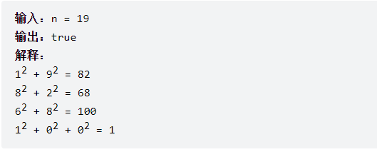

### [242. 有效的字母异位词 ](https://leetcode.cn/problems/valid-anagram/)

给定两个字符串 s 和 t ，编写一个函数来判断 t 是否是 s 的字母异位词。

注意：若 s 和 t 中每个字符出现的次数都相同，则称 s 和 t 互为字母异位词。

 示例 1:

```
输入: s = "anagram", t = "nagaram"
输出: true
```


示例 2:

```
输入: s = "rat", t = "car"
输出: false
```

```java
public class Leetcode_242 {
    public boolean isAnagram(String s, String t) {
        int[] arr = new int[26];
        for (int i = 0; i < s.length(); i++) {
            arr[s.charAt(i) - 'a']++;
        }

        for (int i = 0; i < t.length(); i++) {
            arr[t.charAt(i) - 'a']--;
        }

        for (int i = 0; i < arr.length; i++) {
            if (arr[i] != 0) {
                return false;
            }
        }
        return true;

    }
}
```

### [349. 两个数组的交集 ](https://leetcode.cn/problems/intersection-of-two-arrays/)

给定两个数组 nums1 和 nums2 ，返回 它们的交集 。输出结果中的每个元素一定是 唯一 的。我们可以 不考虑输出结果的顺序 。

示例 1：

```
输入：nums1 = [1,2,2,1], nums2 = [2,2]
输出：[2]
```


示例 2：

```
输入：nums1 = [4,9,5], nums2 = [9,4,9,8,4]
输出：[9,4]
解释：[4,9] 也是可通过的
```

```java
public class Leetcode_349 {
    public int[] intersection(int[] nums1, int[] nums2) {

        if (nums1 == null || nums1.length == 0 || nums2 == null || nums2.length == 0) {
            return new int[0];
        }
        Set<Integer> arr = new HashSet<>();
        Set<Integer> resarr = new HashSet<>();
        for (int i : nums1) {
            arr.add(i);
        }

        for (int i : nums2) {
            if (arr.contains(i)) {
                resarr.add(i);
            }
        }

        return resarr.stream().mapToInt(x -> x).toArray();
    }
}
```

### [202. 快乐数 ](https://leetcode.cn/problems/happy-number/)

编写一个算法来判断一个数 n 是不是快乐数。

「快乐数」 定义为：

对于一个正整数，每一次将该数替换为它每个位置上的数字的平方和。
然后重复这个过程直到这个数变为 1，也可能是 无限循环 但始终变不到 1。
如果这个过程 结果为 1，那么这个数就是快乐数。
如果 n 是 快乐数 就返回 true ；不是，则返回 false 。

示例 1：

- 


示例 2：

```
输入：n = 2
输出：false
```

```java
public class Leetcode_202 {
    public boolean isHappy(int n) {
        Set<Integer> record = new HashSet<>();
        while (n != 1 && !record.contains(n)) {
            record.add(n);
            n = getNextNumber(n);
        }
        return n == 1;
    }

    private int getNextNumber(int n) {
        int res = 0;
        while (n > 0) {
            int temp = n % 10;
            res += temp * temp;
            n = n / 10;
        }
        return res;

    }
}
```

