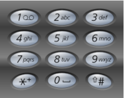
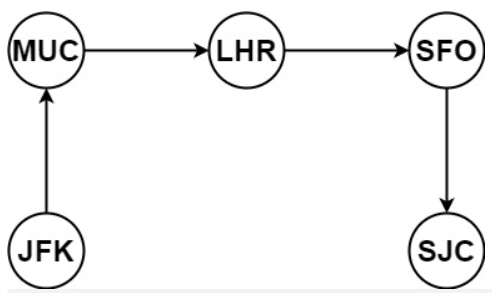
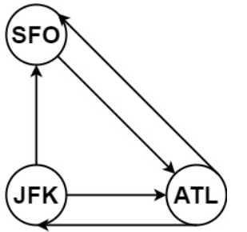
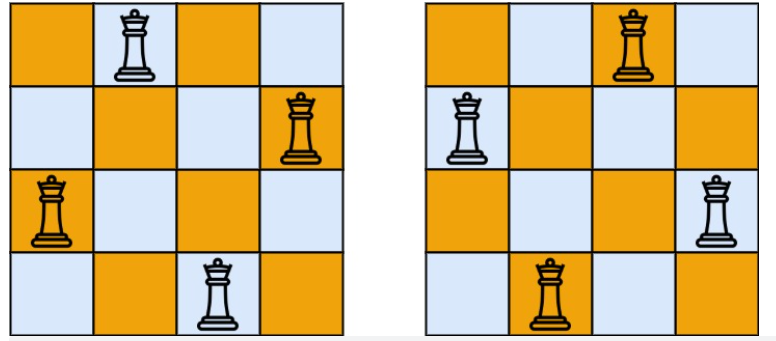

### 回溯法解决的问题

回溯法，一般可以解决如下几种问题：

- 组合问题：N个数里面按一定规则找出k个数的集合
- 切割问题：一个字符串按一定规则有几种切割方式
- 子集问题：一个N个数的集合里有多少符合条件的子集
- 排列问题：N个数按一定规则全排列，有几种排列方式
- 棋盘问题：N皇后，解数独等等


### [77  组合](https://leetcode.cn/problems/combinations/)

给定两个整数 n 和 k，返回范围 [1, n] 中所有可能的 k 个数的组合。

你可以按 任何顺序 返回答案。

示例 1：

```
输入：n = 4, k = 2
输出：
[
  [2,4],
  [3,4],
  [2,3],
  [1,2],
  [1,3],
  [1,4],
]
```


示例 2：

```
输入：n = 1, k = 1
输出：[[1]]
```

```java
public class Leetcode_77 {
    List<List<Integer>> res = new ArrayList<>();
    LinkedList<Integer> path = new LinkedList<>();
    public List<List<Integer>> combine(int n, int k) {
        dfs(n,k,1);
        return res;
    }

    private void dfs(int n,int k,int index){
        if(path.size() == k){
            res.add(new ArrayList<>(path));
            return;
        }
        for(int i = index ;i <= n - (k - path.size()) + 1; i++){
            path.add(i);
            dfs(n,k,i+1);
            path.removeLast();
        }
    }
}
```

### [216  组合总和 III ](https://leetcode.cn/problems/combination-sum-iii/)

找出所有相加之和为 n 的 k 个数的组合，且满足下列条件：

只使用数字1到9
每个数字 最多使用一次 
返回 所有可能的有效组合的列表 。该列表不能包含相同的组合两次，组合可以以任何顺序返回。

示例 1:

```
输入: k = 3, n = 7
输出: [[1,2,4]]
解释:
1 + 2 + 4 = 7
没有其他符合的组合了。
```


示例 2:

```
输入: k = 3, n = 9
输出: [[1,2,6], [1,3,5], [2,3,4]]
解释:
1 + 2 + 6 = 9
1 + 3 + 5 = 9
2 + 3 + 4 = 9
没有其他符合的组合了。
```

```java
public class Leetcode_216 {
    List<List<Integer>> res = new ArrayList<>();
    LinkedList<Integer> path = new LinkedList<>();
    public List<List<Integer>> combinationSum3(int k, int n) {
        dfs(k,n,1,0);
        return res;
    }

    private void dfs(int k, int n, int index,int sum) {
        if(sum > n){
            return;
        }
        if(path.size() > k){
            return;
        }
        if(sum == n && path.size() == k){
            res.add(new ArrayList<>(path));
            return;
        }
        for (int i = index; i <= 9; i++) {
            path.add(i);
            sum += i;
            dfs(k,n,i+1,sum);
            sum -= i;
            path.removeLast();

        }
    }
}
```

### [17  电话号码的字母组合](https://leetcode.cn/problems/letter-combinations-of-a-phone-number/)

给定一个仅包含数字 2-9 的字符串，返回所有它能表示的字母组合。答案可以按 任意顺序 返回。

给出数字到字母的映射如下（与电话按键相同）。注意 1 不对应任何字母。



示例 1：

```
输入：digits = "23"
输出：["ad","ae","af","bd","be","bf","cd","ce","cf"]
```


示例 2：

```
输入：digits = ""
输出：[]
```


示例 3：

```
输入：digits = "2"
输出：["a","b","c"]
```

```java
public class Leetcode_17 {
    List<String> res = new ArrayList<>();
    StringBuilder sb = new StringBuilder();
    String[] numString = {"", "", "abc", "def", "ghi", "jkl", "mno", "pqrs", "tuv", "wxyz"};
    public List<String> letterCombinations(String digits) {
        if(digits == null || digits.length() == 0){
            return res;
        }
        dfs(digits,0);
        return res;
    }

    private void dfs(String digits, int index) {
        if(index == digits.length()){
            res.add(sb.toString());
            return;
        }
        String str = numString[digits.charAt(index) - '0'];
        for (int i = 0; i < str.length(); i++) {
            sb.append(str.charAt(i));
            dfs(digits,index + 1);
            sb.deleteCharAt(sb.length() - 1);
        }
    }
}
```

### [39  组合总和](https://leetcode.cn/problems/combination-sum/)

你一个 无重复元素 的整数数组 candidates 和一个目标整数 target ，找出 candidates 中可以使数字和为目标数 target 的 所有 不同组合 ，并以列表形式返回。你可以按 任意顺序 返回这些组合。

candidates 中的 同一个 数字可以 无限制重复被选取 。如果至少一个数字的被选数量不同，则两种组合是不同的。 

对于给定的输入，保证和为 target 的不同组合数少于 150 个。

示例 1：

```
输入：candidates = [2,3,6,7], target = 7
输出：[[2,2,3],[7]]
解释：
2 和 3 可以形成一组候选，2 + 2 + 3 = 7 。注意 2 可以使用多次。
7 也是一个候选， 7 = 7 。
仅有这两种组合。
```


示例 2：

```
输入: candidates = [2,3,5], target = 8
输出: [[2,2,2,2],[2,3,3],[3,5]]
```


示例 3：

```
输入: candidates = [2], target = 1
输出: []
```

```java
public class Leetcode_39 {
    public List<List<Integer>> combinationSum(int[] candidates, int target) {
        List<List<Integer>> res = new ArrayList<>();
        int len = candidates.length;
        if(len == 0)return res;
        Arrays.sort(candidates);
        LinkedList<Integer> path = new LinkedList<>();
        dfs(res,path,candidates,target,0,0);
        return res;
    }

    private void dfs(List<List<Integer>> res,LinkedList<Integer> path ,
                     int[] candidates, int target, int index, int sum) {
        if(sum == target){
            res.add(new ArrayList<>(path));
            return;
        }
        for(int i = index;i < candidates.length;i++){
            if(sum + candidates[i] > target) return;
            path.add(candidates[i]);
            dfs(res,path,candidates,target,i,sum + candidates[i]);
            path.removeLast();
        }
    }
}
```

### [40  组合总和 II ](https://leetcode.cn/problems/combination-sum-ii/)

给定一个候选人编号的集合 candidates 和一个目标数 target ，找出 candidates 中所有可以使数字和为 target 的组合。

candidates 中的每个数字在每个组合中只能使用 一次 。

注意：解集不能包含重复的组合。 

示例 1:

```
输入: candidates = [10,1,2,7,6,1,5], target = 8,
输出:
[
[1,1,6],
[1,2,5],
[1,7],
[2,6]
]
```


示例 2:

```
输入: candidates = [2,5,2,1,2], target = 5,
输出:
[
[1,2,2],
[5]
]
```

```java
public class Leetcode_40 {
    List<List<Integer>> res = new ArrayList<>();
    LinkedList<Integer> path = new LinkedList<>();
    int sum = 0;
    public List<List<Integer>> combinationSum2(int[] candidates, int target) {
        int len = candidates.length;
        if(len == 0)return res;
        Arrays.sort(candidates);
        dfs(candidates,target,0);
        return res;

    }
    private void dfs(int[] candidates, int target, int index) {
        if(sum == target){
            res.add(new ArrayList<>(path));
            return;
        }
        for (int i = index; i < candidates.length && sum + candidates[i] <= target; i++) {
            if ( i > index && candidates[i] == candidates[i - 1] ) {
                continue;
            }
            sum+=candidates[i];
            path.add(candidates[i]);
            dfs(candidates,target,i+1);
            int temp = path.getLast();
            sum -= temp;
            path.removeLast();
        }

    }
}
```

### [131 分割回文串 ](https://leetcode.cn/problems/palindrome-partitioning/)

给你一个字符串 s，请你将 s 分割成一些子串，使每个子串都是 回文串 。返回 s 所有可能的分割方案。

回文串 是正着读和反着读都一样的字符串。

示例 1：

```
输入：s = "aab"
输出：[["a","a","b"],["aa","b"]]
```


示例 2：

```
输入：s = "a"
输出：[["a"]]
```

```java
public class Leetcode_131 {
    List<List<String>> res = new ArrayList<>();
    LinkedList<String> path = new LinkedList<>();
    public List<List<String>> partition(String s) {

        dfs(s,0);
        return res;
    }
    private void dfs(String s, int index) {
        if(index >= s.length()){
            res.add(new ArrayList<>(path));
            return;
        }
        for (int i = index; i < s.length() ; i++) {
            if(ishuiwen(s,index,i)){
                String str = s.substring(index,i+1);
                path.add(str);
            }else {
                continue;
            }
            dfs(s,i+1);
            path.removeLast();

        }
    }
    private boolean ishuiwen(String s, int index, int end) {
        for(int i =index,j = end;i<j;i++,j--){
            if(s.charAt(i) != s.charAt(j)){
                return false;
            }
        }
        return true;
    }
}
```


### [93 复原 IP 地址 ](https://leetcode.cn/problems/restore-ip-addresses/)

有效 IP 地址 正好由四个整数（每个整数位于 0 到 255 之间组成，且不能含有前导 0），整数之间用 '.' 分隔。

例如："0.1.2.201" 和 "192.168.1.1" 是 有效 IP 地址，但是 "0.011.255.245"、"192.168.1.312" 和 "192.168@1.1" 是 无效 IP 地址。
给定一个只包含数字的字符串 s ，用以表示一个 IP 地址，返回所有可能的有效 IP 地址，这些地址可以通过在 s 中插入 '.' 来形成。你 不能 重新排序或删除 s 中的任何数字。你可以按 任何 顺序返回答案。

示例 1：

```
输入：s = "25525511135"
输出：["255.255.11.135","255.255.111.35"]
```


示例 2：

```
输入：s = "0000"
输出：["0.0.0.0"]
```


示例 3：

```
输入：s = "101023"
输出：["1.0.10.23","1.0.102.3","10.1.0.23","10.10.2.3","101.0.2.3"]
```

```java
public class Leetcode_93 {
    List<String> res = new ArrayList<>();

    public List<String> restoreIpAddresses(String s) {
        if (s.length() > 12) return res;
        dfs(s, 0, 0);
        return res;
    }

    private void dfs(String s, int index, int parIndex) {
        if (parIndex == 3) {
            if (isVaild(s, index, s.length() - 1)) {
                res.add(s);
            }
            return;
        }
        for (int i = index; i < s.length(); i++) {
            if (isVaild(s, index, i)) {
                s = s.substring(0, i + 1) + "." + s.substring(i + 1);
                parIndex++;
                dfs(s, i + 2, parIndex);
                parIndex--;// 回溯
                s = s.substring(0, i + 1) + s.substring(i + 2);
            } else {
                break;
            }
        }


    }

    private boolean isVaild(String s, int start, int end) {
        if (start > end) {
            return false;
        }
        if (s.charAt(start) == '0' && start != end) { // 0开头的数字不合法
            return false;
        }
        int num = 0;
        for (int i = start; i <= end; i++) {
            if (s.charAt(i) > '9' || s.charAt(i) < '0') { // 遇到⾮数字字符不合法
                return false;
            }
            num = num * 10 + (s.charAt(i) - '0');
            if (num > 255) { // 如果⼤于255了不合法
                return false;
           }
        }
        return true;
    }
}
```

### [78  子集](https://leetcode.cn/problems/subsets/submissions/)

给你一个整数数组 nums ，数组中的元素 互不相同 。返回该数组所有可能的子集（幂集）。

解集 不能 包含重复的子集。你可以按 任意顺序 返回解集。

示例 1：

```
输入：nums = [1,2,3]
输出：[[],[1],[2],[1,2],[3],[1,3],[2,3],[1,2,3]]
```


示例 2：

```
输入：nums = [0]
输出：[[],[0]]
```

```java
public class Leetcode_78 {
    List<List<Integer>> res = new ArrayList<>();
    LinkedList<Integer> path =  new LinkedList<>();
    public List<List<Integer>> subsets(int[] nums) {
        dfs(nums,0);
        return res;
    }

    private void dfs(int[] nums, int index) {
         res.add(new ArrayList<>(path));
         if(index >= nums.length) return;
        for (int i = index; i < nums.length; i++) {
            path.add(nums[i]);
            dfs(nums,i+1);
            path.removeLast();
        }
    }
}
```

### [90  子集 II ](https://leetcode.cn/problems/subsets-ii/)

给你一个整数数组 nums ，其中可能包含重复元素，请你返回该数组所有可能的子集（幂集）。

解集 不能 包含重复的子集。返回的解集中，子集可以按 任意顺序 排列。

示例 1：

```
输入：nums = [1,2,2]
输出：[[],[1],[1,2],[1,2,2],[2],[2,2]]
```


示例 2：

```
输入：nums = [0]
输出：[[],[0]]
```

```java
public class Leetcode_90 {
    List<List<Integer>> res = new ArrayList<>();
    LinkedList<Integer> path = new LinkedList<>();
    public List<List<Integer>> subsetsWithDup(int[] nums) {
        Arrays.sort(nums);
        dfs(nums,0);
        return res;
    }

    private void dfs(int[] nums, int index) {
        res.add(new ArrayList<>(path));
        for (int i = index; i < nums.length; i++) {
            if( i > index && nums[i-1] == nums[i]){
                continue;
            }
            path.add(nums[i]);
            dfs(nums,i+1);
            path.removeLast();
        }
    }
}
```

### [491  递增子序列 ](https://leetcode.cn/problems/increasing-subsequences/)

给你一个整数数组 nums ，找出并返回所有该数组中不同的递增子序列，递增子序列中 至少有两个元素 。你可以按 任意顺序 返回答案。

数组中可能含有重复元素，如出现两个整数相等，也可以视作递增序列的一种特殊情况。

示例 1：

```
输入：nums = [4,6,7,7]
输出：[[4,6],[4,6,7],[4,6,7,7],[4,7],[4,7,7],[6,7],[6,7,7],[7,7]]
```


示例 2：

```
输入：nums = [4,4,3,2,1]
输出：[[4,4]]
```

```java
public class Leetcode_491 {
    List<List<Integer>> res = new ArrayList<>();
    LinkedList<Integer> path = new LinkedList();

    public List<List<Integer>> findSubsequences(int[] nums) {
        dfs(nums, 0);
        return res;
    }

    private void dfs(int[] nums, int index) {
        if (path.size() > 1) {
            res.add(new ArrayList<>(path));
        }
        int[] flag = new int[201];
        for (int i = index; i < nums.length; i++) {
            if (!path.isEmpty() && nums[i] < path.get(path.size() - 1) ||
                    (flag[nums[i] + 100] == 1)) {
                continue;
            }
            flag[nums[i] + 100] = 1;
            path.add(nums[i]);
            dfs(nums, i + 1);
            path.removeLast();
        }
    }
}
```

### [46  全排列 ](https://leetcode.cn/problems/permutations/)

给定一个不含重复数字的数组 nums ，返回其 所有可能的全排列 。你可以 按任意顺序 返回答案。

示例 1：

```
输入：nums = [1,2,3]
输出：[[1,2,3],[1,3,2],[2,1,3],[2,3,1],[3,1,2],[3,2,1]]
```


示例 2：

```
输入：nums = [0,1]
输出：[[0,1],[1,0]]
```


示例 3：

```
输入：nums = [1]
输出：[[1]]
```


```java
public class Leetcode_46 {
    List<List<Integer>> res = new ArrayList<>();
    LinkedList<Integer> path = new LinkedList<>();
    public List<List<Integer>> permute(int[] nums) {
        if(nums.length == 0){
            return res;
        }
        dfs(nums,path);
        return res;
    }

    private void dfs(int[] nums, LinkedList<Integer> path) {
        if(path.size() == nums.length){
            res.add(new ArrayList<>(path));
        }
        for (int i = 0; i < nums.length; i++) {
            if(path.contains(nums[i])){
                continue;
            }
            path.add(nums[i]);
            dfs(nums,path);
            path.removeLast();
        }
    }
}
```

### [47  全排列 II ](https://leetcode.cn/problems/permutations-ii/)

给定一个可包含重复数字的序列 nums ，按任意顺序 返回所有不重复的全排列。

示例 1：

```
输入：nums = [1,1,2]
输出：
[[1,1,2],
 [1,2,1],
 [2,1,1]]
```


示例 2：

```
输入：nums = [1,2,3]
输出：[[1,2,3],[1,3,2],[2,1,3],[2,3,1],[3,1,2],[3,2,1]]
```

```java
public class Leetcode_47 {
    List<List<Integer>> res = new ArrayList<>();
    LinkedList<Integer> path = new LinkedList<>();
    int[] flag = new int[21];

    public List<List<Integer>> permuteUnique(int[] nums) {
        if (nums.length == 0) {
            return res;
        }
        Arrays.sort(nums);
        dfs(nums, flag);
        return res;
    }

    private void dfs(int[] nums, int[] flag) {
        if (path.size() == nums.length) {
            res.add(new ArrayList<>(path));
        }
        for (int i = 0; i < nums.length; i++) {
            if (i > 0 && nums[i] == nums[i - 1] && flag[i + 9] == 0) {
                continue;
            }
            if (flag[i + 10] == 0) {
                flag[i + 10] = 1;
                path.add(nums[i]);
                dfs(nums, flag);
                path.removeLast();
                flag[i + 10] = 0;
            }
        }
    }
}
```

### [332  重新安排行程 ](https://leetcode.cn/problems/reconstruct-itinerary/)

给你一份航线列表 tickets ，其中 tickets[i] = [fromi, toi] 表示飞机出发和降落的机场地点。请你对该行程进行重新规划排序。

所有这些机票都属于一个从 JFK（肯尼迪国际机场）出发的先生，所以该行程必须从 JFK 开始。如果存在多种有效的行程，请你按字典排序返回最小的行程组合。

例如，行程 ["JFK", "LGA"] 与 ["JFK", "LGB"] 相比就更小，排序更靠前。
假定所有机票至少存在一种合理的行程。且所有的机票 必须都用一次 且 只能用一次。

示例 1：



```
输入：tickets = [["MUC","LHR"],["JFK","MUC"],["SFO","SJC"],["LHR","SFO"]]
输出：["JFK","MUC","LHR","SFO","SJC"]
```


示例 2：



```
输入：tickets = [["JFK","SFO"],["JFK","ATL"],["SFO","ATL"],["ATL","JFK"],["ATL","SFO"]]
输出：["JFK","ATL","JFK","SFO","ATL","SFO"]
解释：另一种有效的行程是 ["JFK","SFO","ATL","JFK","ATL","SFO"] ，但是它字典排序更大更靠后。
```

```java
public class Leetcode_332 {
    List<String> res;
    LinkedList<String> path = new LinkedList<>();

    public List<String> findItinerary(List<List<String>> tickets) {
        tickets.sort(Comparator.comparing(a -> a.get(1)));
        path.add("JFK");
        boolean[] used = new boolean[tickets.size()];
        dfs(tickets, used);
        return res;
    }

    private boolean dfs(List<List<String>> tickets, boolean[] used) {
        if (path.size() == tickets.size() + 1) {
            res = new LinkedList<>(path);
            return true;
        }
        for (int i = 0; i < tickets.size(); i++) {
            if (!used[i] && tickets.get(i).get(0).equals(path.getLast())) {
                path.add(tickets.get(i).get(1));
                used[i] = true;

                if (dfs(tickets, used)) {
                    return true;
                }
                used[i] = false;
                path.removeLast();
            }
        }
        return false;
    }
}
```

### [51 N 皇后](https://leetcode.cn/problems/n-queens/)

按照国际象棋的规则，皇后可以攻击与之处在同一行或同一列或同一斜线上的棋子。

n 皇后问题 研究的是如何将 n 个皇后放置在 n×n 的棋盘上，并且使皇后彼此之间不能相互攻击。

给你一个整数 n ，返回所有不同的 n 皇后问题 的解决方案。

每一种解法包含一个不同的 n 皇后问题 的棋子放置方案，该方案中 'Q' 和 '.' 分别代表了皇后和空位。

示例 1：



```
输入：n = 4
输出：[[".Q..","...Q","Q...","..Q."],["..Q.","Q...","...Q",".Q.."]]
解释：如上图所示，4 皇后问题存在两个不同的解法。
```


示例 2：

```
输入：n = 1
输出：[["Q"]]
```

```java
public class Leetcode_51 {
    List<List<String>> res = new LinkedList<>();

    public List<List<String>> solveNQueens(int n) {
        char[][] c = new char[n][n];
        for(char[] i : c){
            Arrays.fill(i,'.');
        }
        dfs(n,0,c);
        return res;
    }

    private void dfs(int n, int row, char[][] c) {
        if(row == n){
            res.add(Array2List(c));
            return;
        }
        for (int col = 0; col < n; col++) {
            if(isValid(row,col,n,c)){
                c[row][col] = 'Q';
                dfs(n,row+1,c);
                c[row][col] = '.';
            }
        }
    }

    private boolean isValid(int row, int col, int n, char[][] c) {
        // 检查列
        for (int i=0; i<row; ++i) { // 相当于剪枝
            if (c[i][col] == 'Q') {
                return false;
            }
        }

        // 检查45度对角线
        for (int i=row-1, j=col-1; i>=0 && j>=0; i--, j--) {
            if (c[i][j] == 'Q') {
                return false;
            }
        }

        // 检查135度对角线
        for (int i=row-1, j=col+1; i>=0 && j<=n-1; i--, j++) {
            if (c[i][j] == 'Q') {
                return false;
            }
        }
        return true;
    }

    private List<String> Array2List(char[][] c) {
        List<String> list = new ArrayList<>();

        for (char[] ci : c) {
            list.add(String.copyValueOf(ci));
        }
        return list;
    }
}
```

### [37  解数独 ](https://leetcode.cn/problems/sudoku-solver/)

编写一个程序，通过填充空格来解决数独问题。

数独的解法需 遵循如下规则：

数字 1-9 在每一行只能出现一次。
数字 1-9 在每一列只能出现一次。
数字 1-9 在每一个以粗实线分隔的 3x3 宫内只能出现一次。（请参考示例图）
数独部分空格内已填入了数字，空白格用 '.' 表示。


```
输入：board = [["5","3",".",".","7",".",".",".","."],["6",".",".","1","9","5",".",".","."],[".","9","8",".",".",".",".","6","."],["8",".",".",".","6",".",".",".","3"],["4",".",".","8",".","3",".",".","1"],["7",".",".",".","2",".",".",".","6"],[".","6",".",".",".",".","2","8","."],[".",".",".","4","1","9",".",".","5"],[".",".",".",".","8",".",".","7","9"]]
输出：[["5","3","4","6","7","8","9","1","2"],["6","7","2","1","9","5","3","4","8"],["1","9","8","3","4","2","5","6","7"],["8","5","9","7","6","1","4","2","3"],["4","2","6","8","5","3","7","9","1"],["7","1","3","9","2","4","8","5","6"],["9","6","1","5","3","7","2","8","4"],["2","8","7","4","1","9","6","3","5"],["3","4","5","2","8","6","1","7","9"]]
解释：输入的数独如上图所示，唯一有效的解决方案如下所示：
```


```java
public class Leetcode_37 {
    public void solveSudoku(char[][] board) {
        dfs(board);
    }

    private boolean dfs(char[][] board) {
        for (int i = 0; i < 9; i++) {
            for (int j = 0; j < 9; j++) {
                if (board[i][j] != '.') continue;
                for (char k = '1'; k <= '9'; k++) {
                    if (valid(i, j, k, board)) {
                        board[i][j] = k;
                        if (dfs(board)) return true;
                        board[i][j] = '.';
                    }
                }
                return false;
            }
        }
        return true;
    }

    private boolean valid(int row, int col, char k, char[][] board) {
        for (int i = 0; i < 9; i++) {
            if (board[row][i] == k) {
                return false;
            }
        }

        for (int i = 0; i < 9; i++) {
            if (board[i][col] == k) {
                return false;
            }
        }

        int startx = (row / 3) * 3;
        int starty = (col / 3) * 3;
        for (int i = startx; i < startx + 3; i++) {
            for (int j = starty; j < starty + 3; j++) {
                if (board[i][j] == k) {
                    return false;
                }

            }
        }

        return true;
    }
}
```

