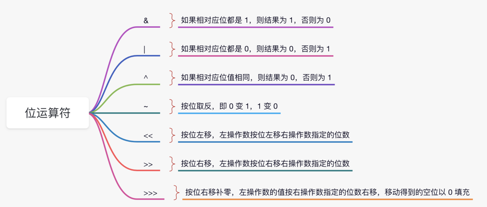

### 1 Hello World详解

Hello World代码演示

```java
public class HelloWord {
    public static void main(String[] args){
        System.out.println("Hello world");
    }
}
```

- 首先，Java 区分大小写。 如果出现了大小写拼写错误（例如， 将 main 拼写成 Main), 程序将无法运行。
- public 关键字： 称为访问修饰符（access modifier), 这 些修饰符用于控制程序的其他部分对这段代码的访问级別。
- class 关键字：表明 Java 程序中的全部内容都包含在类中。这里只需要将类作为一个加载程序逻辑的容器，程序逻辑定义了应用程序的行为。
- 关键字 class 后面紧跟类名。 Java 中定义类名的规则很宽松。名字必须以字母开头，后面可以跟字母和数字的任意组合。长度基本上没有限制。但是不能使用 Java 保留字（例如， public 或 class) 作为类名（保留字列表请参看附录 A)。 标准的命名规范为：类名是以大写字母开头的名词。如果名字由多个单词组成，每个单词的第一个字母都应该大写（这种在一个单词中间使 用大写字母的方式称为驼峰命名法。
- static 关键字：我们可以用它来声明任何一个方法，被 static 修饰后的方法称之为静态方法。静态方法不需要为其创建对象就能调用。
- void 关键字：表示该方法不返回任何值。
- main 关键字：表示该方法为主方法，也就是程序运行的入口。`main()` 方法由 Java 虚拟机执行，配合上 static 关键字后，可以不用创建对象就可以调用，可以节省不少内存空间。
- `String [] args`：`main()` 方法的参数，类型为 String 数组，参数名为 args。
- `System.out.println()`：一个 Java 语句，一般情况下是将传递的参数打印到控制台。System 是 java.lang 包中的一个 final 类，该类提供的设施包括标准输入，标准输出和错误输出流等等。out 是 System 类的静态成员字段，类型为 PrintStream，它与主机的标准输出控制台进行映射。println 是 PrintStream 类的一个方法，通过调用 print 方法并添加一个换行符实现的。

### 2 注释

Java 中的注释有三种：

1. **单行注释** ：通常用于解释方法内某单行代码的作用。

   ```java
   //单行注释
   ```

2. **多行注释** ：通常用于解释一段代码的作用。

3. **文档注释** ：通常用于生成 Java 开发文档。

   ```java
   /**
   * 文档注释
   */
   ```

用的比较多的还是单行注释和文档注释，多行注释在实际开发中使用的相对较少。

### 3 数据类型

Java 是 一种强类型语言。这就意味着必须为每一个变量声明一种类型: 在 Java 中， 共有 8 种基本类型（ primitive type ), 其中有 4 种整型、2 种浮点类型、 1 种用于表示 Unicode 编码的字符 单元的字符类型 char 和 1 种用于表示真值的 boolean 类型。

#### 3.1 整型

整型用于表示没有小数部分的数值， 它允许是负数。Java 提供了 4 种整型

| 基本类型 | 位数 | 字节 | 默认值 | 取值范围                                   |
| :------- | :--- | :--- | :----- | ------------------------------------------ |
| `byte`   | 8    | 1    | 0      | -128 ~ 127                                 |
| `short`  | 16   | 2    | 0      | -32768 ~ 32767                             |
| `int`    | 32   | 4    | 0      | -2147483648 ~ 2147483647                   |
| `long`   | 64   | 8    | 0L     | -9223372036854775808 ~ 9223372036854775807 |

#### 3.2 浮点类型

| 基本类型 | 位数 | 字节 | 默认值 | 取值范围                          |
| -------- | ---- | ---- | ------ | --------------------------------- |
| `float`  | 32   | 4    | 0f     | 1.4E-45 ~ 3.4028235E38            |
| `double` | 64   | 8    | 0d     | 4.9E-324 ~ 1.7976931348623157E308 |

double 表示这种类型的数值精度是 float 类型的两倍（有人称之为双精度数值)。绝大部分应用程序都采用 double 类型。在很多情况下，float 类型的精度很难满足需求。实际上，只有很少的情况适合使用 float 类型，例如，需要单精度数据的库， 或者需要存储大量数据。 float 类型的数值有一个后缀 F 或 f (例如，3.14F。) 没有后缀 F 的浮点数值（如 3.14 ) 默 认为 double 类型。当然，也可以在浮点数值后面添加后缀 D 或 d (例如，3.14D)

**警告**：浮点数值不适用于无法接受舍入误差的金融计算中。 例如，命令 System.out.println ( 2.0-1.1 ) 将打印出 0.8999999999999999, 而不是人们想象的 0.9。这种舍入误差的主要 原因是浮点数值采用二进制系统表示， 而在二进制系统中无法精确地表示分数 1/10。这就好像十进制无法精确地表示分数 1/3 —样。如果在数值计算中不允许有任何舍入误差， 就应该使用 BigDecimal类。

#### 3.3 char类型

| 基本类型 | 位数 | 字节 | 默认值  | 取值范围 |
| -------- | ---- | ---- | ------- | -------- |
| char     | 16   | 2    | 'u0000' | 0-65535  |

char 类型的字面量值要用单引号括起来。例如：'A'是编码值为 65 所对应的字符常量。 它与 "A" 不同，"A" 是包含一个字符 A 的字符串, char 类型的值可以表示为十六进制值，其 范围从 \u0000 到 \Uffff。例如：\u2122 表示注册符号 ( ), \u03C0 表示希腊字母 it。

#### 3.4 boolean类型

boolean (布尔）类型有两个值：false 和 true, 用来判定逻辑条件 整型值和布尔值之间 不能进行相互转换。

### 4 变量

在 Java 中，每个变量都有一个类型（ type)。在声明变量时，变量的类型位于变量名之 前。这里列举一些声明变量的示例：

```java
double salary;
int vacationDays;
long earthPopulation;
boolean done;
```

 每个声明以分号结束。由于声明是一条完整的 Java语句，所以必须以分号结束。

可以在一行中声明多个变量：

 ```java
int i , j; // both are integers
 ```

 不过，不提倡使用这种风格。逐一声明每一个变量可以提高程序的可读性。

#### 4.1 变量初始化

声明一个变量之后，必须用赋值语句对变量进行显式初始化， 千万不要使用未初始化的 变量。例如， Java 编译器认为下面的语句序列是错误的：

```java
int vacationDays; 
System.out.println(vacationDays): // ERROR variable not initialized
```

  要想对一个已经声明过的变量进行赋值， 就需要将变量名放在等号（=) 左侧， 相应取值 的 Java 表达式放在等号的右侧。

```java
 int vacationDays;
 vacationDays:12;
```

 也可以将变量的声明和初始化放在同一行中。例如： 

```java
int vacationDays = 12;
```

 最后，在 Java 中， 变量的声明尽可能地靠近变量第一次使用的地方， 这是一种良好的程序编写 风格。

#### 4.2 常量

在 Java 中， 利用关键字 final 指示常量。例如:

```java
final double CM_PER_INCH = 2.54;
```

关键字 final 表示这个变量只能被赋值一次。一旦被赋值之后，就不能够再更改了。习惯上, 常量名使用全大写。

在 Java 中，经常希望某个常量可以在一个类中的多个方法中使用，通常将这些常量称为 类常量。可以使用关键字 static final设置一个类常量。 

### 5 运算符

整数被 0 除将会产生一个异常， 而浮点数被 0 除将会得到无穷大或 NaN 结果。

#### 5.1数学函数与常量

在 Math类中，包含了各种各样的数学函数。在编写不同类别的程序时，可能需要的函 数也不同。

 要想计算一个数值的平方根， 可以使用 sqrt 方法： 

```java
double x = 4;
double y = Math.sqrt(x);
System.out.println(y); // prints 2.0
```

在 Java中，没有幂运算， 因此需要借助于 Math 类的 pow 方法。语句：

```java
double y = Math.pow(x, a);
```

  将 y 的值设置为 x 的 a 次幂。pow 方法有两个 double 类型的参数， 其返回结果也为 double 类型

Math 类提供了一些常用的三角函数：

```java
 Math.sin 
 Math.cos 
 Math.tan
 Math.atan
 Math.atan2
```

还有指数函数以及它的反函数—自然对数以及以 10 为底的对数：

```java
Math.exp 
Math.log 
Math.log10
```

  最后，Java 还提供了两个用于表示 Π 和 e 常量的近似值：

```java
Math.PI
Math.E
```

#### 5.2 数据类型之间的转换

有 6 个实心箭头，表示无信息丢失的转换；有 3 个虚箭头， 表示可能有精度 损失的转换。

先要将两个操作数转换为同一种类型，然后再进行计算。

 •如果两个操作数中有一个是 double 类型， 另一个操作数就会转换为 double 类型。 

•否则，如果其中一个操作数是 float 类型，另一个操作数将会转换为 float 类型。 

•否则， 如果其中一个操作数是 long 类型， 另一个操作数将会转换为 long 类型。

 •否则， 两个操作数都将被转换为 int 类型。


#### 5.3 强制类型转换

在必要的时候， int 类型的值将会自动地转换为 double 类型。但另 一方面，有时也需要将 double 转换成 int。 在 Java 中， 允许进行这种数值之间的类型转换。 当然， 有可能会丢失一些信息。在这种情况下，需要通过强制类型转换（ cast) 实现这个操作。强制类型转换的语法格式是在圆括号中给出想要转换的目标类型，后面紧跟待转换的变 量名。例如： 

```java
double x = 9.997;
int nx = (int) x; 
```

 这样， 变量 nx 的值为 9。强制类型转换通过截断小数部分将浮点值转换为整型。 

如果想对浮点数进行舍入运算， 以便得到最接近的整数（在很多情况下， 这种操作更有 用，) 那就需要使用 Math.round 方法： 

```java
double x = 9.997; int nx = (int) Math.round(x); 
```

现在， 变量 nx 的值为 10。 当调用 round 的时候， 仍然需要使用强制类型转换（ int。) 其原因 是 round 方法返回的结果为 long 类型，由于存在信息丢失的可能性，所以只有使用显式的强制类型转换才能够将 long 类型转换成 int 类型。

#### 5.4 结合赋值和运算符

可以在赋值中使用二元运算符，这是一种很方便的简写形式。例如：

```java
x += 4; 等价于： x = x + 4; 
```

(一般地， 要把运算符放在 = 号左边，如 *= 或 ％=)。 

 如果运算符得到一个值， 其类型与左侧操作数的类型不同， 就会发生强制类型转 换。

 例如，如果 X 是一个 int, 则以下语句 

x += 3.5; 

是合法的， 将把 x 设置为（int)(x + 3.5)。可以在赋值中使用二元运算符，这是一种很方便的简写形式。

#### 5.5 自增自减运算符

自增、 自减运算符： 

n++ 将变量 n 的当前值加 1, n-- 则将 n 的值减 1。

例如， 以下代码： 

```java
int n = 12; n++;
```

 将 n 的值改为 13。由于这些运算符会改变变量的值，所以它们的操作数不能是数值。例如， 4++ 就不是一个合法的语句。 

实际上， 这些运算符有两种形式；上面介绍的是运算符放在操作数后面的“ 后缀” 形式。 

还有一种“ 前缀” 形式：++n。后缀和前缀形式都会使变量值加 1 或减 1。但用在表达式中时， 二者就有区别了。

前缀形式会先完成加 1; 而后缀形式会使用变量原来的值。

```java
 int m = 7;
 int n = 7; 
 int a = 2 * ++m; // now a is 16, m is 8 
 int b = 2 * n++; // now b is 14, n is 8
```

#### 5.6 关系和布尔运算符

Java 包含丰富的关系运算符：

要检测相等性，可以使用两个等号 == 。例如， 3 == 7 的值为 false。

另外可以使用！= 检测不相等。例如，3 != 7 的值为 true。

还有经常使用的 < (小于、) > (大于) 、<=(小于等于）和 >= (大于等于）运算符

Java 沿用了 C++ 的做法，

使用 && 表示逻辑“ 与” 运算符，使用|| 表示逻辑“ 或” 运算 符。从 != 运算符可以想到，感叹号！就是逻辑非运算符。

&& 和||运算符是按照“ 短路” 方 式来求值的： 如果第一个操作数已经能够确定表达式的值，第二个操作数就不必计算了。

如果用 && 运算符合并两个表达式，

```java
 expression1 && expression2
```

而且已经计算得到第一个表达式的真值为 false, 那么结果就不可能为 true。因此， 第二个表达式就不必计算了。可以利用这一点来避免错误。例如， 在下面的表达式中：

```java
 x != 0 && 1 / x > x + y // no division by 0 
```

如果 x 等于 0, 那么第二部分就不会计算。因此，如果 X 为 0, 也就不会计算 1 / x , 除 以 0 的错误就不会出现。 类似地， 如果第一个表达式为 true， expression1 || expression2 的值就自动为 true, 而无需 计算第二个表达式。 

最后一点，Java 支持三元操作符？：，这个操作符有时很有用。如果条件为 true, 下面的 表达式 condition ? expression1 : expression2 就为第一个表达式的值，否则计算为第二个表达式的值。例如， x < y ? x : y 会返回 x 和 y 中较小的一个

#### 5.7 位运算符



##### &进阶

###### 判断奇偶数

n 以二进制的形式展示的话，其实我们只需要判断最后一个二进制位是 1 还是 0 就行了，如果是 1 的话，代表是奇数，如果是 0 则代表是偶数，所以采用位运算的方式的话，代码如下：

```java
if(n & 1 == 1){
    // n 是个奇数。
}
```

###### m的n次方

例如 n = 13，则 n 的二进制表示为 1101, 那么 m 的 13 次方可以拆解为:

m^1101 = m^0001 * m^0100 * m^1000。

我们可以通过 & 1和 >>1 来逐位读取 1101，为1时将该位代表的乘数累乘到最终结果。

```java
int pow(int n){
    int sum = 1;
    int tmp = m;
    while(n != 0){
        if(n & 1 == 1){
            sum *= tmp;
        }
        tmp *= tmp;
        n = n >> 1;
    }

    return sum;
}
```


##### ^ 进阶

###### 交换两个数

```java
x = x ^ y   // （1）
y = x ^ y   // （2）
x = x ^ y   // （3）
```

两个相同的数**异或**之后结果会等于 0，即 n ^ n = 0。并且任何数与 0 异或等于它本身，即 n ^ 0 = n。所以，解释如下：

把（1）中的 x 带入 （2）中的 x，有

y = x^y = (x^y)^y = x^(y^y) = x^0 = x。 x 的值成功赋给了 y。

对于（3）,推导如下：

x = x^y = (x^y)^x = (x^x)^y = 0^y = y。

###### **找出没有重复的数**

两个相同的数异或的结果是 0，一个数和 0 异或的结果是它本身，所以我们把这一组整型全部异或一下，例如这组数据是：1，  2，  3，  4，  5，  1，  2，  3，  4。其中 5 只出现了一次，其他都出现了两次，把他们全部异或一下，结果如下：

由于异或支持交换律和结合律，所以:

1^2^3^4^5^1^2^3^4 = （1^1)^(2^2)^(3^3)^(4^4)^5= 0^0^0^0^5 = 5。

也就是说，那些出现了两次的数异或之后会变成0，那个出现一次的数，和 0 异或之后就等于它本身。

##### 找出不大于N的最大的2的幂指数

N = 19，那么转换成二进制就是 00010011（这里为了方便，我采用8位的二进制来表示）。那么我们要找的数就是，把二进制中**最左边的 1 保留，后面的 1 全部变为 0**。即我们的目标数是 00010000。那么如何获得这个数呢？相应解法如下：

1、找到最左边的 1，然后把它右边的所有 0 变成 1

2、把得到的数值加 1，可以得到 00100000即 00011111 + 1 = 00100000。

3、把 得到的 00100000 向右移动一位，即可得到 00010000，即 00100000 >> 1 = 00010000。

那么问题来了，第一步中把最左边 1 中后面的 0 转化为 1 该怎么弄呢？我先给出代码再解释吧。下面这段代码就可以把最左边 1 中后面的 0 全部转化为 1，

```java
n |= n >> 1;
n |= n >> 2;
n |= n >> 4;
```

就是通过把 n 右移并且做**或**运算即可得到。我解释下吧，我们假设最左边的 1 处于二进制位中的第 k 位(从左往右数),那么把 n 右移一位之后，那么得到的结果中第 k+1 位也必定为 1,然后把 n 与右移后的结果做或运算，那么得到的结果中第 k 和 第 k + 1 位必定是 1;同样的道理，再次把 n 右移两位，那么得到的结果中第 k+2和第 k+3 位必定是 1,然后再次做或运算，那么就能得到第 k, k+1, k+2, k+3 都是 1，如此往复下去….

最终的代码如下：

```java
int findN(int n){
    n |= n >> 1;
    n |= n >> 2;
    n |= n >> 4;
    n |= n >> 8 // 整型一般是 32 位，上面我是假设 8 位。
    return (n + 1) >> 1;
}
```


#### 5.8 枚举类型

有时候，变量的取值只在一个有限的集合内。例如： 销售的服装或比萨饼只有小、中、 大和超大这四种尺寸。当然， 可以将这些尺寸分别编码为 1、2、3、4 或 S、 M、 L、X。但 这样存在着一定的隐患。在变量中很可能保存的是一个错误的值（如 0 或 m)。 

针对这种情况， 可以自定义枚举类型。枚举类型包括有限个命名的值。 例如， 

```java
enum Size { SMALL, MEDIUM, LARGE, EXTRA.LARCE };
```

 现在，可以声明这种类型的变量：

```java
Size s = Size.MEDIUM;
```

  Size 类型的变量只能存储这个类型声明中给定的某个枚举值，或者 null 值，null 表示这个变量没有设置任何值。

### 6 字符串

Java 没有内置的字符串类型， 而是在标准 Java 类库中提供了 一个预定义类，很自然地叫做 String。每个用双引号括起来的字符串都是 String类的一个实 例： 

```java
String e = ""; // an empty string 
String greeting = "Hello";
```

#### 6.1 子串

String 类的 substring 方法可以从一个较大的字符串提取出一个子串。例如：

```java
String greeting = "Hello";
String s = greeting.substring(0,3); 
```

创建了一个由字符“ Hel” 组成的字符串。

substring 方法的第二个参数是不想复制的第一个位置。这里要复制位置为 0、 1 和 2 (从 0 到 2, 包括 0 和 2 ) 的字符。在 substring 中从 0 开始计数，直到 3 为止， 但不包含 3。 

substring 的工作方式有一个优点：容易计算子串的长度。字符串 s.substring(a, b) 的长度 为 b-a。

例如， 子串“ Hel ” 的长度为 3-0=3。

#### 6.2 拼接

与绝大多数的程序设计语言一样，Java语言允许使用 + 号连接（拼接）两个字符串。

```java
 String expletive = "Expletive";

 String PC13 = "deleted"; 

String message = expletive + PC13; 
```

上述代码将“ Expletivedeleted” 赋给变量 message (注意， 单词之间没有空格， + 号按照 给定的次序将两个字符串拼接起来)。 

如果需要把多个字符串放在一起， 用一个定界符分隔，可以使用静态 join 方法：

```java
String all = String.join( " / ", "S", "M", "L", "XL" ); 
// all is the string "S / H / L / XL"
```

 #### 6.3 不可变字符串

由于不能修改 Java 字符串中的字符， 所以在 Java 文档中将 String 类对象称为不可变字 符串， 如同数字 3 永远是数字 3 —样，字符串“ Hello” 永远包含字符 H、 e、1、 1 和 o 的代 码单元序列， 而不能修改其中的任何一个字符。当然， 可以修改字符串变量 greeting， 让它 引用另外一个字符串， 这就如同可以将存放 3 的数值变量改成存放 4 一样。

通过拼接“ Hel” 和“ p! ” 来创建一个新字符串的 效率确实不高。但是，不可变字符串却有一个优点：编译器可以让字符串共享。可以想象将各种字符串存放在公共的存储池中。字符串变量 指向存储池中相应的位置。如果复制一个字符串变量， 原始字符串与复制的字符串共享相同 的字符。

#### 6.4 检测字符串是否相等

可以使用 equals 方法检测两个字符串是否相等。对于表达式： 

如果字符串 s 与字符串 t 相等， 则返回 true ; 否则， 返回 false。需要注意，s与 t 可以是字符串变量， 也可以是字符串字面量。 

要想检测两个字符串是否相等，而不区分大小写， 可以使用 equalsIgnoreCase 方法。 

```java
s.equals(t) ;
"Hello".equals(greeting);
"Hello".equalsIgnoreCase("hello");
```

一定不要使用=运算符检测两个字符串是否相等！ 这个运算符只能够确定两个字串 是否放置在同一个位置上。

#### 6.5 空串与Null串

空串 "" 是长度为 0 的字符串。可以调用以下代码检查一个字符串是否为空：

```java
if (str.length() = 0) 或 if (str.equals("")) 
```

空串是一个 Java 对象， 有自己的串长度（ 0 ) 和内容（空）。不过， String 变量还可以存 放一个特殊的值， 名为 null, 这表示目前没有任何对象与该变量关联。要检查一个字符串是否为 null, 要使用以下条件： if (str == null)

有时要检查一个字符串既不是 null 也不为空串，这种情况下就需要使用以下条件：

```java
 if (str != null && str.length() != 0)
```

#### 6.6 String API

 **char charAt (int index)** 

返回给定位置的代码单元。除非对底层的代码单元感兴趣， 否则不需要调用这个 方法。

 **int codePointAt(int Index)** 

返回从给定位置开始的码点。

  **int offsetByCodePoints(int startlndex, int cpCount) ** 

返回从 startlndex 代码点开始，位移 cpCount 后的码点索引。 

 **int compareTo(String other)** 

按照字典顺序，如果字符串位于 other 之前， 返回一个负数；如果字符串位于 other 之 后，返回一个正数；如果两个字符串相等，返回 0。

 **IntStream codePoints()**  

将这个字符串的码点作为一个流返回。调用 toArray 将它们放在一个数组中。

  **new String(int[] codePoints, int offset, int count) **

用数组中从 offset 开始的 count 个码点构造一个字符串。 

 **boolean equals(0bject other)** 

如果字符串与 other 相等， 返回 true

**boolean equalsIgnoreCase(String other )** 

如果字符串与 other 相等 （ 忽略大小写，) 返回 true。 

**boolean startsWith(String prefix )** 

**boolean endsWith(String suffix )** 

如果字符串以 suffix 开头或结尾， 则返回 true。 

**int indexOf(String str)** 

**int indexOf(String str, int fromlndex )** 

**int indexOf(int cp)** 

**int indexOf(int cp, int fromlndex )** 

返回与字符串 str 或代码点 cp 匹配的第一个子串的开始位置。这个位置从索引 0 或 fromlndex 开始计算。 如果在原始串中不存在 str， 返回 -1。

**int lastIndexOf(String str)**

**int lastIndexOf(String str, int fromlndex )** 

**int lastindexOf(int cp)** 

**int lastindexOf(int cp, int fromlndex )** 

返回与字符串 str 或代码点 cp 匹配的最后一个子串的开始位置。 这个位置从原始串尾 端或 fromlndex 开始计算。 

**int length( )** 

返回字符串的长度。 

**int codePointCount(int startlndex , int endlndex )** 

 返回 startlndex 和 endludex-1之间的代码点数量。没有配成对的代用字符将计入代码点。 

**String replace( CharSequence oldString,CharSequence newString)**

 返回一个新字符串。这个字符串用 newString 代替原始字符串中所有的 oldString。可 以用 String 或 StringBuilder 对象作为 CharSequence 参数。

 **String substring(int beginlndex )** 

 **String substring(int beginlndex, int endlndex )**

 返回一个新字符串。这个字符串包含原始字符串中从 beginlndex 到串尾或 endlndex-1 的所有代码单元。 

**String toLowerCase( )** 

**String toUpperCase( )** 

返回一个新字符串。 这个字符串将原始字符串中的大写字母改为小写，或者将原始字 符串中的所有小写字母改成了大写字母。

**String trim( )** 

返回一个新字符串。这个字符串将删除了原始字符串头部和尾部的空格。 

**String join(CharSequence delimiter, CharSequence ... elements )** 

 返回一个新字符串， 用给定的定界符连接所有元素

#### 6.7 构建字符串

如果需要用许多小段的字符串构建一个字符串， 那么应该按照下列步骤进行。 

首先， 构建一个空的字符串构建器： 

```java
//首先， 构建一个空的字符串构建器： 
StringBuilder builder = new StringBuilder(); 

//当每次需要添加一部分内容时， 就调用 append 方法。 

builder.append(ch); // appends a single character 

bui1der.append(str); // appends a string 

//在需要构建字符串时就凋用 toString 方法， 将可以得到一个 String 对象，其中包含了构建器 中的字符序列。

 String completedString = builder.toString();
```


**注释**：在 JDK5.0 中引入 StringBuilder 类。 这个类的前身是 StringBuffer, 其效率稍有些低， 但允许采用多线程的方式执行添加或删除字符的操作 。 如果所有字符串在一个单线程中编辑 （通常都是这样) ， 则应该用 StringBuilder 替代它。 这两个类的 API是相同的。

**API**

```java
StringBuilder()//构造一个空的字符串构建器
    
int length()//返回构建器或缓冲器中的代码单元数量
    
StringBuilder append(String str)//追加一个字符串并返回 this
    
StringBuilder append(char c)//追加一个代码单元并返回 this
    
StringBuilder appendCodePoint(int cp)//追加一个代码点，并将其转换为一个或两个代码单元并返回 this
    
void setCharAt(int i ,char c)//将第 i 个代码单元设置为 c
    
StringBuilder insert(int offset,String str)//在 offset 位置插入一个字符串并返回 this
    
StringBuilder insert(int offset,char c)//在 offset 位置插入一个代码单元并返回 this
    
StringBuilder delete(int startindex,int endlndex)//删除偏移量从 startindex 到 -endlndex-1 的代码单元并返回 this
    
String toString()//返回一个与构建器或缓冲器内容相同的字符串
```

### 7 输入输出

打印输出到“ 标准输出流”（即控制台窗口）是一件非常容易的事情，只要 调用 System.out.println 即可。然而，读取“ 标准输入流” System.in 就没有那么简单了。要想通 过控制台进行输人，首先需要构造一个 Scanner 对象，并与“ 标准输人流” System.in 关联。

```java
Scanner in = new Scanner(System.in);
//nextLine 方法将输入一行。
System.out.print("What is your name? ");
String name = in.nextLine();
//在这里，使用 nextLine 方法是因为在输人行中有可能包含空格。要想读取一个单词（以空白符作为分隔符) 就调用
String firstName = in.next();
//要想读取一个整数， 就调用 nextlnt 方法。
System.out.print("How old are you? ")；
int age = in.nextlnt();
```

### 8 控制流程

我们的程序都是从上往下依次运行的，但是，仅仅是这样还不够，我们需要更加高级的控制语句来使得程序更加有趣。比如，判断一个整数变量，大于1则输出yes，小于1则输出no，这时我们就需要用到选择结构来帮助我们完成条件的判断和程序的分支走向。学习过C语言就很轻松！

#####  代码块与作用域
在开始流程控制语句之前，我们先来介绍一下代码块和作用域。

不知道各位小伙伴是否在一开始就注意到了，为什么程序中会有一些成对出现的花括号？这些花括号代表什么意思呢？

```java
public class Main {   //外层花括号
    public static void main(String[] args) {   //内层花括号开始
    } //内层花括号结束
}
```

我们可以在花括号中编写一句又一句的代码，实际上这些被大括号囊括起来的内容，我们就称为块（代码块），一个代码块中可以包含多行代码，我们可以在里面做各种各样的事情，比如定义变量、进行计算等等。

我们可以自由地创建代码块：

```java
public static void main(String[] args) {   //现目前这个阶段，我们还是在主方法中编写代码，不要跑去外面写
    System.out.println("外层");
    {   //自由创建代码块
        int a = 10;
        System.out.println(a);
    }
}
```

虽然创建了代码块，但实际上程序依然是按照从上到下的顺序在进行的，所以说这里还是在逐行运行，即使使用花括号囊括。那咋一看这不就是没什么卵用吗？我们来看看变量。

我们创建的变量，实际上是有作用域的，并不是在任何地方都可以使用，比如：


变量的使用范围，仅限于其定义时所处的代码块，一旦超出对应的代码块区域，那么就相当于没有这个变量了。

```java
public static void main(String[] args) {
    int a = 10;   //此时变量在最外层定义
    {
        System.out.println(a);   //处于其作用域内部的代码块可以使用
    }
    System.out.println(a);   //这里肯定也可以使用
}
```

##### 选择结构
某些时候，我们希望进行判断，只有在条件为真时，才执行某些代码，这种情况就需要使用到选择分支语句，首先我们来认识一下if语句：

```java
if (条件判断) 判断成功执行的代码;
```

```java
public static void main(String[] args) {
    int a = 15;
    if(a == 15)    //只有当a判断等于15时，才会执行下面的打印语句
      	System.out.println("Hello World!");
  	System.out.println("我是外层");   //if只会对紧跟着的一行代码生效，后续的内容无效
}
```


if会进行判断，只有判断成功时才会执行紧跟着的语句，否则会直接跳过，注意，如果我们想要在if中执行多行代码，需要使用代码块将这些代码囊括起来（实际上代码块就是将多条语句复合到一起）所以说，我们以后使用if时，如果分支中有多行代码需要执行，就需要添加花括号，如果只有一行代码，花括号可以直接省略，包括我们后面会讲到的else、while、for语句都是这样的。

```java
public static void main(String[] args) {
    int a = 15;
    if(a > 10) {    //只有判断成功时，才会执行下面的代码块中内容，否则直接跳过
        System.out.println("a大于10");
        System.out.println("a的值为："+a);
    }
  	System.out.println("我是外层");
}
```

如果我们希望判断条件为真时执行某些代码，条件为假时执行另一些代码，我们可以在后面继续添加else语句：

public static void main(String[] args) {
    int a = 15;
    if(a > 10) {    //只有判断成功时，才会执行下面的代码块中内容，否则直接跳过
        System.out.println("a大于10");
        System.out.println("a的值为："+a);
    } else {   //当判断不成功时，会执行else代码块中的代码
        System.out.println("a小于10");
        System.out.println("a的值为："+a);
    }
    System.out.println("我是外层");
}
1
2
3
4
5
6
7
8
9
10
11
if-else语句就像两个分支，跟据不同的判断情况从而决定下一步该做什么，这跟我们之前认识的三元运算符性质比较类似。

那如果此时我们需要判断多个分支呢？比如我们现在希望判断学生的成绩，不同分数段打印的等级不一样，比如90以上就是优秀，70以上就是良好，60以上是及格，其他的都是不及格，那么这种我们又该如何判断呢？要像这样进行连续判断，我们需要使用else-if来完成：

public static void main(String[] args) {
    int score =  2;
    if(score >= 90)    //90分以上才是优秀
        System.out.println("优秀");
     else if (score >= 70)    //当上一级if判断失败时，会继续判断这一级
        System.out.println("良好");
     else if (score >= 60)
        System.out.println("及格");
     else    //当之前所有的if都判断失败时，才会进入到最后的else语句中
        System.out.println("不及格");
}
1
2
3
4
5
6
7
8
9
10
11
当然，if分支语句还支持嵌套使用，比如我们现在希望低于60分的同学需要补习，0-30分需要补Java，30-60分需要补C++，这时我们就需要用到嵌套：

public static void main(String[] args) {
    int score =  2;
    if(score < 60) {   //先判断不及格
        if(score > 30)    //在内层再嵌套一个if语句进行进一步的判断
            System.out.println("学习C++");
        else
            System.out.println("学习Java");
    }
}
1
2
3
4
5
6
7
8
9
除了if自己可以进行嵌套使用之外，其他流程控制语句同样可以嵌套使用，也可以与其他流程控制语句混合嵌套使用。这样，我们就可以灵活地使用if来进行各种条件判断了。

前面我们介绍了if语句，我们可以通过一个if语句轻松地进行条件判断，然后根据对应的条件，来执行不同的逻辑，当然除了这种方式之外，我们也可以使用switch语句来实现，它更适用于多分支的情况：

switch (目标) {   //我们需要传入一个目标，比如变量，或是计算表达式等
  case 匹配值:    //如果目标的值等于我们这里给定的匹配值，那么就执行case后面的代码
    代码...
    break;    //代码执行结束后需要使用break来结束，否则会溜到下一个case继续执行代码
}
1
2
3
4
5
比如现在我们要根据学生的等级进行分班，学生有ABC三个等级：

public static void main(String[] args) {
    char c = 'A';
    switch (c) {  //这里目标就是变量c
        case 'A':    //分别指定ABC三个匹配值，并且执行不同的代码
            System.out.println("去尖子班！准备冲刺985大学！");
            break;   //执行完之后一定记得break，否则会继续向下执行下一个case中的代码
        case 'B':
            System.out.println("去平行班！准备冲刺一本！");
            break;
        case 'C':
            System.out.println("去职高深造。");
            break;
    }
}
1
2
3
4
5
6
7
8
9
10
11
12
13
14
switch可以精准匹配某个值，但是它不能进行范围判断，比如我们要判断分数段，这时用switch就很鸡肋了。

当然除了精准匹配之外，其他的情况我们可以用default来表示：

switch (目标) {
    case: ...
    default:
    		其他情况下执行的代码
}
1
2
3
4
5
我们还是以刚才那个例子为例：

public static void main(String[] args) {
    char c = 'A';
    switch (c) {
        case 'A':
            System.out.println("去尖子班！");
            break;
        case 'B':
            System.out.println("去平行班！");
            break;
        case 'C':
            System.out.println("去差生班！");
            break;
        default:   //其他情况一律就是下面的代码了
            System.out.println("去读职高，分流");
    }
}

1
2
3
4
5
6
7
8
9
10
11
12
13
14
15
16
当然switch中可以继续嵌套其他的流程控制语句，比如if：

public static void main(String[] args) {
    char c = 'A';
    switch (c) {
        case 'A':
            if(c == 'A') {    //嵌套一个if语句
                System.out.println("去尖子班！");
            }
            break;
        case 'B':
            System.out.println("去平行班！");
            break;
    }
}
1
2
3
4
5
6
7
8
9
10
11
12
13
目前，我们已经认识了两种选择分支结构语句。

循环结构
通过前面的学习，我们了解了如何使用分支语句来根据不同的条件执行不同的代码，我们接着来看第二种重要的流程控制语句：循环语句。

我们在某些时候，可能需要批量执行某些代码：

public static void main(String[] args) {
    System.out.println("伞兵一号卢本伟准备就绪！");   //把这句话给我打印三遍
    System.out.println("伞兵一号卢本伟准备就绪！");
    System.out.println("伞兵一号卢本伟准备就绪！");
}
1
2
3
4
5
遇到这种情况，我们由于还没学习循环语句，那么就只能写N次来实现这样的多次执行。但是如果此时要求我们将一句话打印100遍、1000遍、10000遍，那么我们岂不是光CV代码就要搞一下午？

现在，要解决这种问题，我们可以使用for循环语句来多次执行：

for (表达式1;表达式2;表达式3) 循环体;
1
介绍一下详细规则：

表达式1：在循环开始时仅执行一次。
表达式2：每次循环开始前会执行一次，要求为判断语句，用于判断是否可以结束循环，若结果为真，那么继续循环，否则结束循环。
表达式3：每次循环完成后会执行一次。
循环体：每次循环都会执行一次循环体。
一个标准的for循环语句写法如下：

public static void main(String[] args) {
  	//比如我们希望让刚刚的打印执行3次
    for (int i = 0; i < 3; i++)    //这里我们在for语句中定义一个变量i，然后每一轮i都会自增，直到变成3为止
        System.out.println("伞兵一号卢本伟准备就绪！");   //这样，就会执行三轮循环，每轮循环都会执行紧跟着的这一句打印
}
1
2
3
4
5
我们可以使用调试来观察每一轮的变化，调试模式跟普通的运行一样，也会执行我们的Java程序，但是我们可以添加断点，也就是说当代码运行到断点位置时，会在这里暂停，我们可以观察当代码执行到这个位置时各个变量的值：


调试模式在我们后面的学习中非常重要，影响深远，所以说各位小伙伴一定要学会。调试也很简单，我们只需要点击右上角的调试选项即可（图标像一个小虫子一样，因为调试的英文名称是Debug）


调试开始时，我们可以看到程序在断点位置暂停了：


此时我们可以观察到当前的局部变量i的值，也可以直接在下方的调试窗口中查看：


随着循环的进行，i的值也会逐渐自增：


当i增长到2时，此时来到最后一轮循环，再继续向下运行，就不再满足循环条件了，所以说此时就会结束循环。

当然，如果要执行多条语句的话，只需要使用花括号囊括就行了：

for (int i = 0; i < 3; i++) {
    System.out.println("伞兵一号卢本伟准备就绪！");
    System.out.println("当前i的值为："+i);
}
1
2
3
4
注意这里的i仅仅是for循环语句中创建的变量，所以说其作用域被限制在了循环体中，一旦离开循环体，那么就无法使用了：


但是我们可以将i的创建放到外面：

public static void main(String[] args) {
    int i = 0;   //在外面创建变量i，这样全部范围内都可以使用了
    for (; i < 3; i++) {   //for循环的三个表达式并不一定需要编写
        System.out.println("伞兵一号卢本伟准备就绪！");
        System.out.println("当前i的值为："+i);
    }
    System.out.println("当前i的值为："+i);
}
1
2
3
4
5
6
7
8
和之前的if一样，for循环同样支持嵌套使用：

public static void main(String[] args) {
    for (int i = 0; i < 3; i++)    //外层循环执行3次
        for (int j = 0; j < 3; j++)    //内层循环也执行3次
            System.out.println("1！5！");
}
1
2
3
4
5
上面的代码中，外层循环会执行3轮，而整个循环体又是一个循环语句，那么也就是说，每一轮循环都会执行里面的整个循环，里面的整个循环会执行3，那么总共就会执行3 x 3次，也就是9次打印语句。

实际上，for循环的三个表达式并不一定需要编写，我们甚至可以三个都不写：

public static void main(String[] args) {
    for (;;)   //如果什么都不写，相当于没有结束条件，这将会导致无限循环
        System.out.println("伞兵一号卢本伟准备就绪！");
}
1
2
3
4
如果没有表达式2，那么整个for循环就没有结束条件，默认会判定为真，此时就会出现无限循环的情况（无限循环是很危险的，因为它会疯狂地消耗CPU资源来执行循环，可能很快你的CPU就满载了，一定要避免）

当然，我们也可以在循环过程中提前终止或是加速循环的进行，这里我们需要认识两个新的关键字：

public static void main(String[] args) {
    for (int i = 0; i < 3; i++) {
        if(i == 1) continue;   //比如我们希望当i等于1时跳过这一轮，不执行后面的打印
        System.out.println("伞兵一号卢本伟准备就绪！");
        System.out.println("当前i的值为："+i);
    }
}
1
2
3
4
5
6
7
我们可以使用continue关键字来跳过本轮循环，直接开启下一轮。这里的跳过是指，循环体中，无论后面有没有未执行的代码，一律不执行，比如上面的判断如果成功，那么将执行continue进行跳过，虽然后面还有打印语句，但是不会再去执行了，而是直接结束当前循环，开启下一轮。

在某些情况下，我们可能希望提前结束循环：

for (int i = 0; i < 3; i++) {
    if(i == 1) break;   //我们希望当i等于1时提前结束
    System.out.println("伞兵一号卢本伟准备就绪！");
    System.out.println("当前i的值为："+i);
}
1
2
3
4
5
我们可以使用break关键字来提前终止整个循环，和上面一样，本轮循环中无论后续还有没有未执行的代码，都不会执行了，而是直接结束整个循环，跳出到循环外部。

虽然使用break和continue关键字能够更方便的控制循环，但是注意在多重循环嵌套下，它只对离它最近的循环生效（就近原则）：

for (int i = 1; i < 4; ++i) {
    for (int j = 1; j < 4; ++j) {
        if(i == j) continue;    //当i == j时加速循环
        System.out.println(i+", "+j);
    }
}
1
2
3
4
5
6
这里的continue加速的对象并不是外层的for，而是离它最近的内层for循环，break也是同样的规则：

for (int i = 1; i < 4; ++i) {
    for (int j = 1; j < 4; ++j) {
        if(i == j) break;    //当i == j时终止循环
        System.out.println(i+", "+j);
    }
}
1
2
3
4
5
6
那么，要是我们就是想要终止或者是加速外层循环呢？我们可以为循环语句打上标记：

outer: for (int i = 1; i < 4; ++i) {   //在循环语句前，添加 标签: 来进行标记
    inner: for (int j = 1; j < 4; ++j) {
        if(i == j) break outer;    //break后紧跟要结束的循环标记，当i == j时终止外层循环
        System.out.println(i+", "+j);
    }
}
1
2
3
4
5
6
如果一个代码块中存在多个循环，那么直接对当前代码块的标记执行break时会直接跳出整个代码块：

outer: {    //直接对整个代码块打标签
    for (int i = 0; i < 10; i++) {
        if (i == 7){
            System.out.println("Test");
            break outer;   //执行break时，会直接跳出整个代码块，而不是第一个循环
        }
    }

    System.out.println("？？？");
}
1
2
3
4
5
6
7
8
9
10
虽然效果挺奇特的，但是一般情况下没人这么玩，所以说了解就行了。

前面我们介绍了for循环语句，我们接着来看第二种while循环，for循环要求我们填写三个表达式，而while相当于是一个简化版本，它只需要我们填写循环的维持条件即可，比如：

while(循环条件) 循环体;
1
相比for循环，while循环更多的用在不明确具体的结束时机的情况下，而for循环更多用于明确知道循环的情况，比如我们现在明确要进行循环10次，此时用for循环会更加合适一些，又比如我们现在只知道当i大于10时需要结束循环，但是i在循环多少次之后才不满足循环条件我们并不知道，此时使用while就比较合适了。

public static void main(String[] args) {
    int i = 100;   //比如现在我们想看看i不断除以2得到的结果会是什么，但是循环次数我们并不明确
    while (i > 0) {   //现在唯一知道的是循环条件，只要大于0那么就可以继续除
        System.out.println(i);
        i /= 2;   //每次循环都除以2
    }
}
1
2
3
4
5
6
7
上面的这种情况就非常适合使用while循环。

和for循环一样，while也支持使用break和continue来进行循环的控制，以及嵌套使用：

public static void main(String[] args) {
    int i = 100;
    while (i > 0) {
        if(i < 10) break;
        System.out.println(i);
        i /= 2;
    }
}
1
2
3
4
5
6
7
8
我们也可以反转循环判断的时机，可以先执行循环内容，然后再做循环条件判断，这里要用到do-while语句：

public static void main(String[] args) {
    int i = 0;   //比如现在我们想看看i不断除以2得到的结果会是什么，但是循环次数我们并不明确
    do {  //无论满不满足循环条件，先执行循环体里面的内容
        System.out.println("Hello World!");
        i++;
    } while (i < 10);   //再做判断，如果判断成功，开启下一轮循环，否则结束
}

