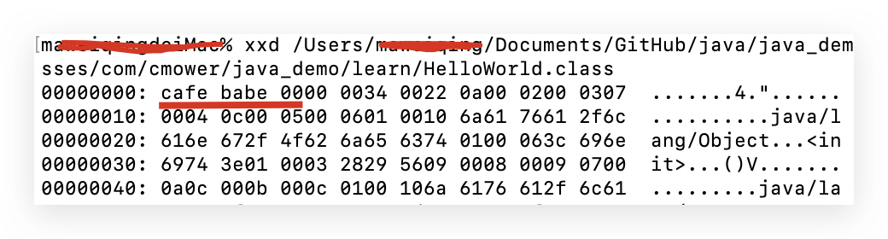
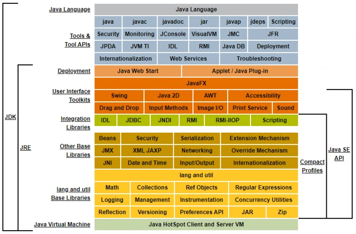

# Java概述

### 简介

Java 是一门计算机编程语言，高级、健壮、面向对象，并且非常安全。它由 Sun 公司在 1995 年开发，主力开发叫 James Gosling，被称为 Java 之父。

Java 在叫“Java”之前，其实叫 Oak（橡树的意思，我感觉好像比 Java 好听一些）。怎么想到橡树的呢？James Gosling 坐在办公室，望向窗外，视野里出现了一颗橡树。不过，遗憾的是，Oak 已经被另外一家公司注册了，因此 1995 年 5 月 23 日，Oak 语言改名为 Java。

Java 这名字并不是 James Gosling 的首选，也不是命名团队的首选。团队其他人员更青睐 Silk（丝绸），但 Gosling 不喜欢，他本人喜欢的是 Lyric（抒情诗），但没通过律师这一关。最后，排在第四位的“Java”脱颖而出。

James Gosling 回忆说，“Java”是一个叫 Mark Opperman 的人提议的，他是在一家咖啡店得到灵感的。奇妙的是，“Java”这个单词也是印度尼西亚爪哇岛的英文名，因生产咖啡而闻名，巧不巧？

使用十六进制编辑器（比如说 [wxMEditopen in new window](https://wxmedit.github.io/zh_CN/)）打开由 Java 源代码编译出的二进制文件（.class 文件，后面会详细介绍，先不着急），就可以看得到，最前面的 8 个字符是 CA FE BA BE（定义文件类型的魔数），即词组“CAFE BABE”（咖啡屋宝贝），是不是还挺有意思的？



就目前来说，Java 不仅仅是一门编程语言，它还是一个由一系列计算机软件和规范组成的技术体系，这个技术体系提供了完整的用于软件开发和跨平台部署的支持环境，并广泛应用于以下这些场合。”

- 1）桌面应用程序；
- 2）Web 应用程序；
- 3）企业应用程序，体现出了 Java 的安全性、负载均衡和集群的优势；
- 4）移动端应用程序，主要是安卓；
- 5）嵌入式系统；
- 6）机器人技术；
- 7）游戏。

Java 能够获得如此广泛的认可，除了它是一门结构严谨、面向对象的编程语言之外，还有很多其他不可忽视的优点：

- 摆脱了硬件平台的束缚，实现了“一次编写，处处运行”的理念；
- 内存管理相对安全，避免了绝大部分内存泄露和指针越界的问题；
- 实现了热点代码检测和运行时编译，使得 Java 应用能随着运行时间的增长而获得更高的性能；
- 有一套完善的应用程序接口，还有无数来自商业机构和开源社区的第三方类库。

### 发展简史

Sun 公司在 SunWorld 大会上正式发布了 Java 1.0 版本，第一次提出了“Write Once, Run anywhere”的口号。《时代》杂志将 Java 评为 1995 年十大最佳产品之一。

1996 年 1 月 23 日，JDK 1.0 发布，Java 语言有了第一个正式版本的运行环境。JDK 1.0 是一个纯解释执行的 Java 虚拟机，代表技术有：Java 虚拟机、AWT（图形化界面）、Applet。

4 月，十个主要的操作系统和计算机供应商宣称将在产品中嵌入 Java 技术。9 月，已有大约 8.3 万网页应用采用了 Java 来制作。5 月底，第一届 JavaOne 大会在旧金山举行，从此，JavaOne 成为全世界数百万 Java 语言开发者的技术盛会。

1997 年 2 月 19 日，JDK 1.1 发布，代表技术有：JAR 文件格式、JDBC、JavaBeans、RMI（远程方法调用）。

1998 年 12 月 4 日，JDK 1.2 发布，这是一个里程碑式的版本。Sun 在这个版本中把 Java 拆分为三个方向：面向桌面开发的 J2SE、面向企业开发的 J2EE，面向移动开发的 J2ME。代表技术有：EJB、Swing。

2000 年 5 月 8 日，JDK 1.3 发布，对 Java 2D 做了大幅修改。

2002 年 2 月 13 日，JDK 1.4 发布，这是 Java 真正走向成熟的一个版本，IBM、富士通等著名公司都有参与。代表技术有：正则表达式、NIO。

2004 年 9 月 30 日，JDK 5 发布，注意 Sun 把“1.x”的命名方式抛弃了。JDK 5 在 Java 语法的易用性上做出了非常大的改进，比如说：自动装箱、泛型、动态注解、枚举、可变参数、foreach 循环。

2006 年 12 月 11 日，JDK 6 发布，J2SE 变成了 Java SE 6，J2EE 变成了 Java EE 6，J2ME 变成了 Java ME 6。JDK 6 恐怕是 Java 历史上使用寿命最长的一个版本了。主要的原因有：代码复杂性的增加、世界经济危机、Oracle 对 Sun 的收购。

JDK 6 的最后一个升级补丁为 Java SE 6 Update 211， 于 2018 年 10 月 18 日发布——12 年的跨度啊！

2009 年 2 月 19 日，JDK 7 发布，但功能是阉割的。很多翘首以盼的功能都没有完成，比如说 Lambda 表达式。主要是因为 Sun 公司在商业上陷入了泥沼，已经无力推动 JDK 7 的研发工作。

2009 年 4 月 20 日，Oracle 以 74 亿美元的价格收购了市值曾超过 2000 亿美元的 Sun 公司——太阳终究还是落山了。对于 Java 语言这个孩子来说，可以说是好事，也可以说是坏事。好事是 Oracle 有钱，能够注入资金推动 Java 的发展；坏处就是 Oracle 是后爸，对 Java 肯定没有 Sun 那么亲，走的是极具商业化的道路。

2014 年 3 月 18 日，JDK 8 终于来了，步伐是那么蹒跚，但终究还是来了。带着最强有力的武器——Lambda 表达式而来。虽然 JDK 19 马上就发布了，但“新版任你发，我用 Java 8”的梗至今还流传着。

2017 年 9 月 21 日，JDK 9 发布。从此以后，JDK 更新版本的速度令开发者应接不暇，半年一个版本，虽然 Oracle 的目的是好的，为了避免因功能增加而引发的跳票风险，但不得不承认，版本更新的节奏实在是有点过于频繁。

这就导致一个问题，好不容易更新一个版本，用了六个月后，Oracle 不维护了。针对这个问题，Oracle 给出的解决方案挺奇葩的，每六个 JDK 大版本才会被长期支持（Long Term Support，LTS）。

JDK 8 是 LTS 版，2018 年 9 月 25 日发布的 JDK 11 是 LTS 版， 2018 年 3 月 20 日发布的 JDK 10 就可以一笔带过了。

2021 年发布的 JDK 17 是目前最新的 LTS 版本。

JDK 12、JDK 13、JDK 14、JDK 15、JDK 16、JDK 18、JDK 19 都是过渡产品，就好像是试验品一样，不太受开发者待见。

Java 发展到今天已经 20 多年了，作为一个编程语言确实不简单，Java 代表的面向对象思想确实给工程领域带来了革命性的变化，关键是 Java 一直在拥抱变化。

大数据方面，有 Apache Kafka、Apache Samza、Apache Storm、Apache Spark、Apache Flink，除了 Spark 是基于 JVM 的函数语言 Scala 编写的，其余都是 Java 编写的。

Java 在云时代面临着以 Go 语言为主的容器（Docker 等技术）生态圈的挑战，但是，Java 的大型分布式系统越来越多，Java 在云计算与分布式系统中还是扮演着主要角色，并且形成了一个大型的生态圈。

### Java特点

#### 简单性

Java 语法是 C++ 语法的一个“ 纯净” 版本。这里没有头文件、 指针运算（甚至指针语法、) 结构、 联合、 操作符重载、 虚基类等。然而，设计者并没有试图清除 C++ 中所有不适当的特性。例如， switch 语句的语法在 Java 中就没有改变。如果你了解 C++ 就会发现可以轻而易举地转换到 Java语法。

简单的另一个方面是小。Java 的目标之一是支持开发能够在小型机器上独立运 行的软件。 基本的解释器以及类支持大约仅为 40KB ; 再加上基础的标准类库和对 线程的支持（基本上是一个自包含的微内核） 大约需要增加 175KB。

#### 面向对象

简单地讲， 面向对象设计是一种程序设计技术。 它将重点放在教椐 （ 即对象）和对象的接口上。用木匠打一个比方， 一个“ 面向对象的” 木匠始终关注的是所制作的椅子， 第二位才是所使用的工具；一个“ 非面向对象的” 木匠首先考虑的是所用的工具。在本质上，Java 的面向对象能力与 C++是一样的。

开发 Java 时面向对象技术已经相当成熟。 Java 的面向对象特性与 C++ 旗鼓相当。Java 与 C++ 的主要不同点在于多重继承，在 Java 中，取而代之的是更简单的接口概念。与 C++ 相比，Java 提供了更丰富的运行时自省功能

#### 可移植性

与 C 和 C++ 不同，Java 规范中没有“ 依赖具体实现” 的地方基本教据类型的 大小以及有关运算都做了明确的说明 u 例如，Java 中的 int 永远为 32 位的整数，而在 C/C++ 中， int 可能是 16 位整数、 32 位整 数， 也可能是编译器提供商指定的其他大小。唯一的限制只是 int 类型的大小不能低于 short int, 并且不能高于 long int。在 Java 中，数据类型具有固定的大小， 这消除了代码移植时令 人头痛的主要问题。 二进制数据以固定的格式进行存储和传输， 消除了字节顺序的困扰。字符串是用标准的 Unicode 格式存储的。

Java 先编译生成字节码，再由 JVM（Java 虚拟机）来解释执行，目的就是将统一的字节码转成操作系统可以识别的二进制码，然后执行。而针对不同的操作系统，都有相应版本的 JVM，所以 Java 就实现了可移植性。

#### 安全性

Java 适用于网络/分布式环境，为了达到这个目标，在安全方面投入了巨大的精力。使用 Java 可以构建防病毒、防篡改的程序。

从一开始，Java 就设计了很多可以防范攻击的机制，比如说：

- 运行时堆栈溢出，这是蠕虫病毒常用的攻击手段。
- 字节码验证，可以确保代码符合 JVM 规范并防止恶意代码破坏运行时环境。
- 安全的类加载，可以防止不受信任的代码干扰 Java 程序的运行。
- 全面的 API 支持广泛的加密服务，包括数字签名、消息摘要、（对称、非对称）密码、密钥生成器。
- 安全通信，支持 HTTPS、SSL，保护传输的数据完整性和隐私性。

#### 多线程

Java 在多线程方面做得非常突出，只要操作系统支持，Java 中的线程就可以利用多个处理器，带来了更好的交互响应和实时行为。

### 安装JDK

#### JVM、JRE、JDK 有什么关系

JDK（Java Development Kit）是用于开发 Java 应用程序的软件环境。里面包含运行时环境（JRE）和其他 Java 开发所需的工具，比如说解释器（java）、编译器（javac）、文档生成器（javadoc）等等。

JRE（Java Runtime Environment）是用于运行 Java 应用程序的软件环境。也就是说，如果只想运行 Java 程序而不需要开发 Java 程序的话，只需要安装 JRE 就可以了。

JVM (Java Virtual Machine) ，也就是 Java 虚拟机，由一套字节码指令集、一组寄存器、一个栈、一个垃圾回收堆和一个存储方法域等组成，屏蔽了不同操作系统（macOS、Windows、Linux）的差异性，使得Java能够“一次编译，到处运行”。

这是 Oracle 官方给出的 JDK、JRE、JVM 关系图。



[JDK安装详细教程]([JDK1.8下载安装与配置_wbjyouzhi的博客-CSDN博客_jdk1.8下载配置](https://blog.csdn.net/wbjyouzhi/article/details/118545168))

### Hello World详解

Hello World代码演示

```java
public class HelloWord {
    public static void main(String[] args){
        System.out.println("Hello world");
    }
}
```

- class 关键字：用于在 Java 中声明一个类。
- public 关键字：一个表示可见性的访问修饰符。
- static 关键字：我们可以用它来声明任何一个方法，被 static 修饰后的方法称之为静态方法。静态方法不需要为其创建对象就能调用。
- void 关键字：表示该方法不返回任何值。
- main 关键字：表示该方法为主方法，也就是程序运行的入口。`main()` 方法由 Java 虚拟机执行，配合上 static 关键字后，可以不用创建对象就可以调用，可以节省不少内存空间。
- `String [] args`：`main()` 方法的参数，类型为 String 数组，参数名为 args。
- `System.out.println()`：一个 Java 语句，一般情况下是将传递的参数打印到控制台。System 是 java.lang 包中的一个 final 类，该类提供的设施包括标准输入，标准输出和错误输出流等等。out 是 System 类的静态成员字段，类型为 PrintStream，它与主机的标准输出控制台进行映射。println 是 PrintStream 类的一个方法，通过调用 print 方法并添加一个换行符实现的。

