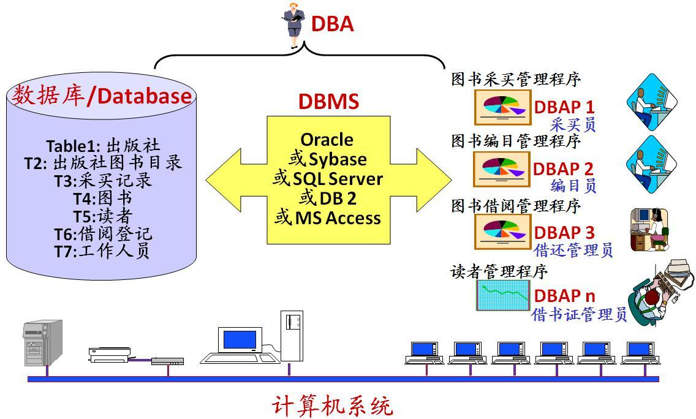

#### 什么是数据库, 数据库管理系统, 数据库系统, 数据库管理员?

- **数据库** : 数据库(DataBase 简称 DB)就是信息的集合或者说数据库是由数据库管理系统管理的数据的集合。
- **数据库管理系统** : 数据库管理系统(Database Management System 简称 DBMS)是一种操纵和管理数据库的大型软件，通常用于建立、使用和维护数据库。
- **数据库系统** : 数据库系统(Data Base System，简称 DBS)通常由软件、数据库和数据管理员(DBA)组成。
- **数据库管理员** : 数据库管理员(Database Administrator, 简称 DBA)负责全面管理和控制数据库系统。

数据库系统基本构成如下图所示：

#### 主键和外键有什么区别?

- **主键(主码)** ：主键用于唯一标识一个元组，不能有重复，不允许为空。一个表只能有一个主键。
- **外键(外码)** ：外键用来和其他表建立联系用，外键是另一表的主键，外键是可以有重复的，可以是空值。一个表可以有多个外键。

#### 对于外键和级联，阿里巴巴开发手册这样说到：

> 【强制】不得使用外键与级联，一切外键概念必须在应用层解决。
>
> 说明: 以学生和成绩的关系为例，学生表中的 student_id 是主键，那么成绩表中的 student_id 则为外键。如果更新学生表中的 student_id，同时触发成绩表中的 student_id 更新，即为级联更新。外键与级联更新适用于单机低并发，不适合分布式、高并发集群; 级联更新是强阻塞，存在数据库更新风暴的风 险; 外键影响数据库的插入速度

#### 什么是 ER 图？

**E-R 图** 也称实体-联系图(Entity Relationship Diagram)，提供了表示实体类型、属性和联系的方法，用来描述现实世界的概念模型。 它是描述现实世界关系概念模型的有效方法。 是表示概念关系模型的一种方式。

下图是一个学生选课的 ER 图，每个学生可以选若干门课程，同一门课程也可以被若干人选择，所以它们之间的关系是多对多（M: N）。另外，还有其他两种关系是：1 对 1（1:1）、1 对多（1: N）。

我们试着将上面的 ER 图转换成数据库实际的关系模型(实际设计中，我们通常会将任课教师也作为一个实体来处理)：

#### 数据库三大范式

**1NF(第一范式)**

属性（对应于表中的字段）不能再被分割，也就是这个字段只能是一个值，不能再分为多个其他的字段了。**1NF 是所有关系型数据库的最基本要求** ，也就是说关系型数据库中创建的表一定满足第一范式。

**2NF(第二范式)**

2NF 在 1NF 的基础之上，消除了非主属性对于码的部分函数依赖。如下图所示，展示了第一范式到第二范式的过渡。第二范式在第一范式的基础上增加了一个列，这个列称为主键，非主属性都依赖于主键。

**3NF(第三范式)**

3NF 在 2NF 的基础之上，消除了非主属性对于码的传递函数依赖 。符合 3NF 要求的数据库设计，**基本**上解决了数据冗余过大，插入异常，修改异常，删除异常的问题。比如在关系 R(学号 , 姓名, 系名，系主任)中，学号 → 系名，系名 → 系主任，所以存在非主属性系主任对于学号的传递函数依赖，所以该表的设计，不符合 3NF 的要求。

**总结**

- 1NF：属性不可再分。
- 2NF：1NF 的基础之上，消除了非主属性对于码的部分函数依赖。
- 3NF：3NF 在 2NF 的基础之上，消除了非主属性对于码的传递函数依赖 。

#### 数据库设计分为哪几步？

1. **需求分析** : 分析用户的需求，包括数据、功能和性能需求。
2. **概念结构设计** : 主要采用 E-R 模型进行设计，包括画 E-R 图。
3. **逻辑结构设计** : 通过将 E-R 图转换成表，实现从 E-R 模型到关系模型的转换。
4. **物理结构设计** : 主要是为所设计的数据库选择合适的存储结构和存取路径。
5. **数据库实施** : 包括编程、测试和试运行
6. **数据库的运行和维护** : 系统的运行与数据库的日常维护。

#### MySQL 字符集

不同的字符集的主要区别在于：

- 可以表示的字符范围
- 编码方式

MySQL 字符编码集中有两套 UTF-8 编码实现：

- **`utf8`** ： `utf8`编码只支持`1-3`个字节 。 在 `utf8` 编码中，中文是占 3 个字节，其他数字、英文、符号占一个字节。但 emoji 符号占 4 个字节，一些较复杂的文字、繁体字也是 4 个字节。
- **`utf8mb4`** ： UTF-8 的完整实现，正版！最多支持使用 4 个字节表示字符，因此，可以用来存储 emoji 符号。

因此，如果你需要存储`emoji`类型的数据或者一些比较复杂的文字、繁体字到 MySQL 数据库的话，数据库的编码一定要指定为`utf8mb4` 而不是`utf8` ，要不然存储的时候就会报错了。

#### 常见数据库引擎的区别

##### MyIsam

MyIsam存储引擎独立位于操作系统，也就是可以在Windows上使用，也可以把比较简单的数据转移到Linux操作系统上去，这种存储引擎在创建表的时候，会创建三个文件，一个是.frm文件用于存储表的定义，一个是.MYD用于存储表的数据，另一个是.MYI文件，存储的是索引，操作系统对大文件的操作是比较慢的，这样将表分为三个文件，那么.MYD这个文件单独来存放数据自然可以优化数据库的查询等操作。

特点：

1 不支持事务，但并不代表着有事务操作的项目不能用MyIsam存储引擎，可以在service层进行根据自己的业务需求进行相应控制

2 不支持外键

3 查询速度很快，如果数据库insert和update的操作比较多的话，采用表锁效率低。(建议使用innodb)

4 对表进行加锁

##### InnoDB

InnoDB是一个事务型的存储引擎，有行级锁和外键约束，适用于以下的场合；更新多的表，适合处理多重并发的更新请求。

1 支持事务

2 可以从灾难中恢复过来(通过bin-log日志等)

3 外键约束，只有他支持外键

4 支持自动增加列属性

##### Memory

Memory采用的逻辑介质是内存，响应速度应该是很快的，但是当mysqld守护进程崩溃的时候数据会丢失，另外，要求存储的数据是长度不变的格式，比如，Blob和Text类型的数据不可用(长度不固定)

使用Memory存储引擎情况

1 目标数据比较小，而且非常频繁的进行访问，在内存中存放数据，如果太大的数据会造成内存溢出，可以通过参数max_heap_table_size控制Memory表的大小，限制Memory表的最大的大小。

2 如果数据是临时的，而且必须立即可用得到，那么就可以放在内存中。

3 存储在Memory表中的数据如果突然间丢失也没有太大的关系

#### 数据类型

##### 整型

##### 浮点数

FLOAT和DOUBLE 类型只能使用标准的浮点数进行近似运算，如果需要精确运算   则使用DECIMAL类型

DECIMAL(M,D)M表示总的数字，D表示小数位

##### 字符型

char

格式char(n),   是定长的 格式会根据定义的长度分配空间，当存储char值时，mysql会删除所有的末尾空格。

varchar

格式VARCHAR(n) 其中n是数字，VARCHAR用于存储可变长的字符串，他比定长型更省空间，varchar需要使用1或2个额外字节记录字符串的长度，如果列的最大长度小于或等于255字节，则只使用1个字节表示，如果列长度大于255字节，则需要使用2个字节表示长度。

BLOB和Text

这两个都是为了存储很大数据而设计的字符串数据类型，分别采用二进制和字符方式存储。

##### 日期型

##### 枚举型

格式：ENUM('value1','value2'),  

一个ENUM 最多能有65535不同的值

