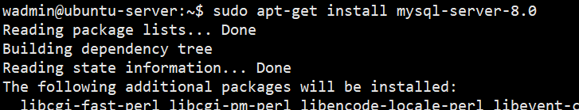
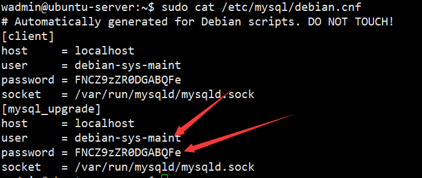

### Ubuntu虚拟机安装

#### 1 命令安装

```sql
sudo apt-get install mysql-server-8.0
```



#### 2查看mysql的密码

```sql
sudo cat /etc/mysql/debian.cnf
```



#### 3 登录数据库

```sql
mysql -u(user名） -p（password）
```

